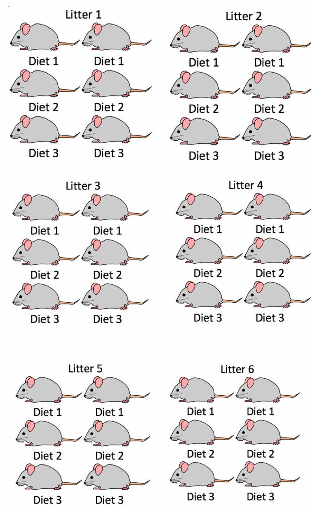
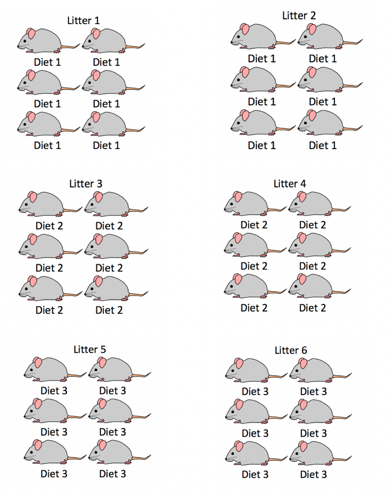
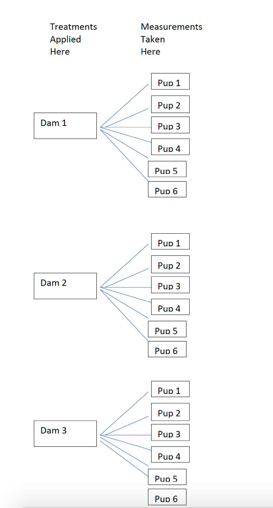
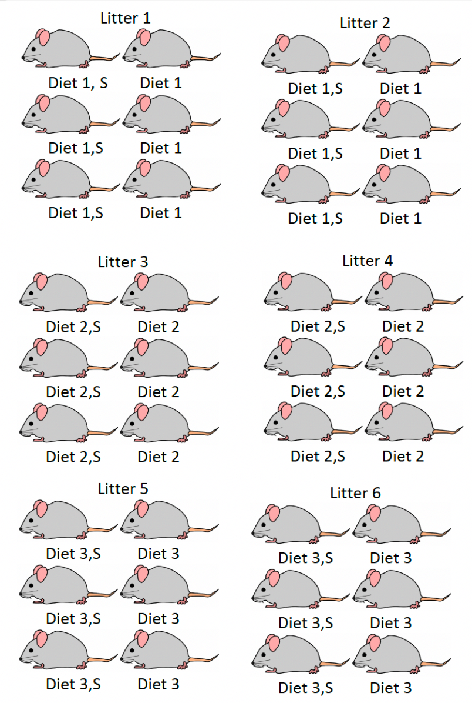
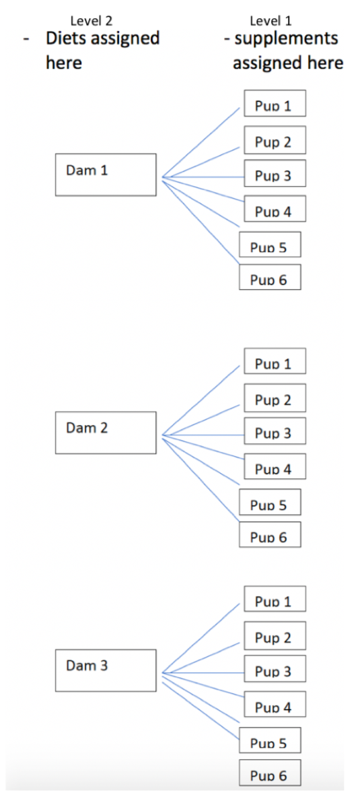

# Introduction to Correlated Data


```{r}
library(tidyverse)
library(lme4)
library(lmerTest)
library(knitr)
```


## Introduction to Correlated Data


### Weight Gain in Mice: Experiment Design #1

Consider an experiment designed to assess the impact of three different diets on weight gain in mice. We observe six different litters of mice, with six mice in each litter. Within each litter, two mice are randomly assigned to each of the three diets. Researchers recorded the mean weight gain in each mouse over a four-week period. 

Experimental Design 1:

```{r, echo=FALSE, fig.cap="Mouse Experiment Version 1", out.width = '45%'}

```


### Mice Experiment 1 Data

```{r, echo=FALSE}
set.seed(02032021)
nlitters <- 6
ndiets <- 3
nreps <- 2
litter <- rep(1:nlitters, each=ndiets*nreps)
litter_mean <- rnorm(nlitters, 0.05, 0.05)
mouse_weight <- rep(litter_mean, each=ndiets*nreps)
diet <- rep(c("A","B","C"),nlitters*nreps)
diet_effect <- 0.009*(diet=="A") - 0.012*(diet=="B") 
weight_gain <- rnorm(nlitters*ndiets*nreps, mouse_weight + diet_effect, 0.01)
mice <- data.frame(litter, diet, weight_gain)   
```

The first 10 rows of the dataset look like this:


```{r}
head(mice,10)
```

### A Naive Graphical Analysis

Let's temporarily ignore the fact that some mice came from the same litter, and treat all observations as independent. 

The plot below shows the weight gain (or loss) for each of the mice, by diet. The red dots and connecting lines show the mean weight gain for each diet. 

The ensuing table shows the mean and standard deviation in weight gain for each of the three diets. 

```{r}
ggplot(data=mice, aes(x=factor(diet), y=weight_gain))  + geom_point()  + 
  stat_summary(fun="mean", geom="line", aes(group=factor(1)))  +
  stat_summary(fun="mean", geom="point", color="red", size=2)
```


**Question:**

Based on this graph, do you think there is evidence of diets have an effect on weight gain in mice? Why or why not?


### A More Informed Graphical Analysis   

So far, we've ignored the fact that some of the mice came from the same litter. Now, let's take litter into account. The figure below colors the mice by litter. 

The lines represent the average weight gain (or loss) in each litter. 

```{r}
ggplot(data=mice, aes(x=factor(diet), y=weight_gain, color=factor(litter))) + 
  geom_point() +  stat_summary(fun="mean", geom="line", aes(group=factor(litter)))
```

It may be helpful to examine each litter individually. 

```{r}
ggplot(data=mice, aes(x=factor(diet), y=weight_gain, color=factor(litter))) + 
  geom_point()  + 
  facet_grid(.~litter, scales = "free") + 
  stat_summary(fun="mean", geom="line", aes(group=factor(litter)))
```


**Question:** 

Based on the information about litters, do your thoughts about whether diets have an effect on weight gain in mice change? Does there appear to be stronger evidence of differences between groups? Weaker? Same?   


### Assessing Evidence of Differences

Conceptually, we can assess whether there is evidence of differences between the diets by considering differences in mean weights, relative to the amount of unexplained variability between mice in the same litter and on the same diet.  

Recall that when testing for a difference between two groups, a t-statistic is calculated using the formula

\[
t= \frac{\bar{x}_1-\bar{x}_2}{\sqrt{\frac{s_1^2}{n_1}+\frac{s_1^2}{n_1}}}
\]

The numerator measures the size of the differences between the groups, and the denominator measures the amount of unexplained variability between individuals in the same group. 

### Table of Mean Weight By Diet and Litter

```{r}
mouse_groups <- mice %>% group_by(diet, litter)%>% 
  summarize(Mean_Weight=mean(weight_gain), SD_Weight = sd(weight_gain), N=n())
mouse_groups
```

Since each mouse in a litter received a different treatment, we can use the standard deviations between mice in the same litter to assess the amount of unexplained variability after accounting for litter and diet. 


### Table of Mean Weight By Diet

What if we fail to account for litter?

```{r}
mouse_groups <- mice %>% group_by(diet)%>% 
  summarize(Mean_Weight=mean(weight_gain), SD_Weight = sd(weight_gain), N=n())
mouse_groups
```

Notice standard deviations are much larger! This is because we're now comparing mice from different litters to one another.    

When we fail to account for litter, variability thqt can be explained by differences between litters becomes conflated with unexplained variability. 

This causes us to overestimate unexplained variability and makes differences between groups look less meaningful than they really are.   


### An Improper Statistical Analysis

We've seen graphically, and in table form, how accounting for litter impacts our ability to discern differences between diets. Now, let's look at how this happens in a statistical model.   


If we ignore the fact that some mice are from the same litter, and wrongly treat them as independent, we might use an ordinary linear least squares regression model. 

```{r}
M1 <- lm(data=mice, weight_gain~factor(diet))
summary(M1)$coefficients
```

The p-values on line 2 is large, indicating that there is not evidence of differences in weight gain between mice on diet 2, and the baseline diet (diet 1).  

The same is true for a comparison of diets 3 and 1, as seen on the third line.   

### A More Appropriate Statistical Analysis

The following command fits a linear mixed effects model (or multilevel model) that accounts for correlation between mice in the same litter. 

```{r}
M2 <- lmer(data=mice, weight_gain~factor(diet) + (1 | factor(litter)))
summary(M2)$coeff
```

* Estimates are unchanged, but standard errors decrease by a factor of almost 10.   
* t-statistics are now high, and p-values low, indicating differences between the diets     

Just as we saw graphically, and in tables, accounting for differences between litters allows us to accurately quantify unexplained variability, and assess whether there is evidence of differences in weight gain between the diets.   

## LLSR Model for Mice Experiment

### Model Formulation

Let $Y_{ij}$ denote the weight gain of mouse $j$ in litter $i$. $j=1,2,\ldots, 6$, $j=1,2,\ldots, 6$.  

In an ordinary linear least squares regression model, we assume that:   

* each diet has an expected (or average) weight gain    
* individual mice vary from their expected weights randomly, according to normal distributions with constant variance $\sigma^2$     
* no two mice are any more or less alike than any others, except for diet (which is not true in this context)

A model would have the form:

\[
Y_{ij}  = \beta_{0}+\beta_{1}\textrm{DietB}_{ij} +\beta_{2}\textrm{DietC}_{ij} + \epsilon_{ij},
\]


Examples: 

| | Diet|  Expected Weight | Random Deviation | 
|------------------------------|:----|:------|:---------------|:--------------|
| Litter 1, Mouse 1 | A | $\beta_0$ | $\epsilon_{11}$|   
| Litter 1, Mouse 3 | B | $\beta_0 + \beta_1$ |  $\epsilon_{13}$ |
| Litter 1, Mouse 5 | C | $\beta_0 + \beta_2$ | $\epsilon_{15}$ |
| Litter 2, Mouse 1 | A | $\beta_0$ | $\epsilon_{21}$|   
| Litter 2, Mouse 3 | B | $\beta_0 + \beta_1$ |  $\epsilon_{23}$ |
| Litter 2, Mouse 5 | C | $\beta_0 + \beta_2$ | $\epsilon_{25}$ |


### Model Accounting For Correlation 

Let $Y_{ij}$ denote the weight gain of mouse $j$ in litter $i$. $j=1,2,\ldots, 6$, $j=1,2,\ldots, 6$.  

We assume that:   

* expected (or average) weight gain differs between diets      
* individual litters vary from their expected weight randomly, according to normal distributions with constant variance $\sigma^2_l$   
* within each litter, individual mice vary from their expected weights randomly, according to normal distributions with constant variance $\sigma^2$    


A model would have the form:

\[
Y_{ij}  = \beta_{0}+\beta_{1}\textrm{DietB}_{ij} +\beta_{2}\textrm{DietC}_{ij} + l_{i} + \epsilon_{ij},
\]

where $l_i\sim\mathcal{N}(0, \sigma^2_l)$, and $\epsilon_{ij} \sim\mathcal{N}(0, \sigma^2)$.  


| | Diet|  Expected Weight | Random Deviation | 
|------------------------------|:----|:------|:---------------|:--------------|
|Litter 1, Mouse 1 | A |  $\beta_0$ | $l_1 + \epsilon_{11}$|   
|Litter 1, Mouse 3 | B |  $\beta_0 + \beta_1$ | $l_1 + \epsilon_{13}$|   
|Litter 1, Mouse 5  | C |  $\beta_0 + \beta_2$ | $l_1 + \epsilon_{15}$|   
|Litter 2, Mouse 1  | A |  $\beta_0$ | $l_2 + \epsilon_{21}$|   
|Litter 2, Mouse 3  | B |  $\beta_0 + \beta_1$ | $l_2 + \epsilon_{23}$|   
|Litter 2, Mouse 5  | C |  $\beta_0 + \beta_2$ | $l_2 + \epsilon_{25}$|   


### Questions of Interest

The model 

\[
Y_{ij}  = \beta_{0}+\beta_{1}\textrm{DietB}_{ij} +\beta_{2}\textrm{DietC}_{ij} + l_{i} + \epsilon_{ij},
\]

where $l_i\sim\mathcal{N}(0, \sigma^2_l)$, and $\epsilon_{ij} \sim\mathcal{N}(0, \sigma^2)$

has 5 parameters:

* $\beta_0$ - average weight gain for mice on diet A.    
* $\beta_1$ - difference in average weight gain for mice on diet B, compared to to diet A    
* $\beta_2$ - difference in average weight gain for mice on diet C, compared to to diet A    
* $\sigma_L$ - standard deviation in the distribution of differences between litters (i.e. variability explained by litter)     
* $\sigma$ - standard deviation in the distribution of differences between individual mice in the same litter (i.e. unexplained variability)      


Thus, for a mouse in litter 1, the expected weight gain follows a normal distribution with mean $\beta_0$ and variance $\sigma^2_l + \sigma^2$.    

For a mouse in litter 2, the expected weight gain follows a normal distribution with mean $\beta_0 + \beta_2$ and variance $\sigma^2_l + \sigma^2$  

This is based on the fact that the sum of two independent normal random variables is normal, with mean equal to the sum of the means and variance equal to the sum of the variances.   


### Fixed and Random Effects    

In this case, we want to test for whether there are differences in weight gain between the diets. 

There is no reason to test for differences in weight gain between the litters. Differences between these specific litters of mice are not important to us. We're not interested in drawing conclusions about these specific mice. They're just a sample of participants, being used to investigate the diets. It's likely that we'll never acually see these specific litters of mice beyond this study.   

We still need to account for litter, though, because it helps explain, or account for, variability that would otherwise go unexplained.    

* Variables for which we want to investigate differences or relationships are called **fixed effects**. We should build these into the "expectation structure" of the model, using $\beta_j$'s.   
* Variables that we are not interested in testing for differences or relationships between, but that we still want to include in our model in order to account for correlation and explain variability are called **random effects.** We should add these to the model as normally distributed error terms.    
* Accounting for random effects allows us to accurately calculate standard errors associated with fixed effects.    
* A model that involves both fixed and random effects is called a **linear mixed effects model**.    


### Fitting the Model in R    

To fit a linear mixed effects model in R, we use the `lmer()` command that is part of the `lme4` package. It is also helpful to load the `lmerTest` package, in order to obtain p-values in the output.   
  

To add a random effect for a variable add `(1 | variable_name)` in the model.   

```{r}
M2 <- lmer(data=mice, weight_gain~factor(diet) + (1 | factor(litter)))
summary(M2)
```

**Estimates and Interpretations**    

* $\beta_0 = 0.058$: We estimate that average weight gain for Diet A is 0.058 g.    
* $\beta_1 = -0.024$: We estimate that mice on diet B gain 0.024 g. less than mice on diet A, on average.   
* $\beta_2 = -0.011$: We estimate that mice on diet C gain 0.011 g. less than mice on diet A, on average.    

The "Random effects" table gives estimates of $\sigma^2_l$ (litters) and $\sigma^2$ (Residual).  

* $\sigma_l = 0.061$: We estimate that the standard deviation in differences in weights between litters, after accounting for diet, is 0.061 g.       
* $\sigma = 0.007$: We estimate that the standard deviation in differences in weights between mice within a litter, after accounting for diet, is 0.007 g.    

There is evidence of differences between the diets.  
There is more variability in weight between different litters than between mice in the same litter, after accounting for diet.   

## A Second Mice Experiment 

### Weight Gain in Mice: Experiment 2

Now consider a different structure of the mouse experiment. 

In this version of the experiment, the three diets were randomly assigned to six pregnant mice, so that two mice were assigned to each diet. Each of the six mice (dams), gave birth to six pups, creating six litters of six, as seen before. Researchers the observed the mean weight gain of the pups over a four week period.   

Now, each pup in a litter has necessarily been assigned to the same diet, since diets were assigned to the dams, before the pups were born. 

Experimental Design 2:

```{r, echo=FALSE, fig.cap="Mouse Experiment Version 2", out.width = '75%'}

```

### Mice Experiment 2 Data

```{r, echo=FALSE}
set.seed(02032021)
nlitters <- 6
ndiets <- 3
nreps <- 2
litter <- rep(1:nlitters, each=ndiets*nreps)
litter_mean <- rnorm(nlitters, 0.05, 0.05)
mouse_weight <- rep(litter_mean, each=ndiets*nreps)
diet <- rep(c("A", "B", "C"), each = nlitters*nreps)
diet_effect <- 0.009*(diet=="A") - 0.012*(diet=="B") 
weight_gain <- rnorm(nlitters*ndiets*nreps, mouse_weight + diet_effect, 0.01)
mice2 <- data.frame(litter, diet, weight_gain) 
```

The first 15 rows of the dataset look like this:

```{r}
head(mice2,15)
```

### Experiment 2: A Naive Graphical Analysis

Again, we'll temporarily ignore the fact that mice come from the same litter and treat all observations as independent. 


```{r}
ggplot(data=mice2, aes(x=factor(diet), y=weight_gain))  + geom_point()  + 
  stat_summary(fun="mean", geom="line", aes(group=factor(1)))+  
  stat_summary(fun="mean", geom="point", color="red", size=2)
```


### Experiment 2: A More Informed Graphical Analysis

Now, we'll account for the fact that mice in the same litter got the same diets. The plot below adds color to show litter.  

```{r}
ggplot(data=mice2, aes(x=factor(diet), y=weight_gain, color=factor(litter))) + geom_point() 
```

Since diets were assigned to litters, not individual mice, it is the litters we should be comparing. In fact, our sample size here is really not the 36 individual mice, but rather the 6 litters. 

Thus, the best graphical analysis would come from the following plot, which displays average weight for each litter:

```{r}
Litters <- mice2 %>% group_by(diet, litter)%>% 
  summarize(weight_gain=mean(weight_gain), N=n())
```


```{r}
ggplot(data=Litters, aes(x=factor(diet), y=weight_gain, color=factor(litter))) + geom_point() 
```

### Experiment 2: Table of Mean Weight By Diet 

```{r}
mouse_groups <- mice2 %>% group_by(diet)%>% 
  summarize(Mean_Weight=mean(weight_gain), SD_Weight = sd(weight_gain), N=n())
mouse_groups
```

This standard deviations in this table pertain to variability between the 12 mice that got each diet (6 from one litter and 6 from another).  

These are not useful here, since diets were assigned to litters, not individual mice.  

### Experiment 2: Table Comparing Litters Means by Diet   

We now look at means and standard deviations between litter means, using the average rate in each litter as the response variable.  

```{r}
litter_groups <- Litters %>% group_by(diet)%>% 
  summarize(Mean_Weight=mean(weight_gain), SD_Weight = sd(weight_gain), N=n())
litter_groups
```


### An Inappropriate Model for the Second Design

An ordinarly linear least squares regression model fails to account for the fact that treatments were assigned to litters, not mice. It is based on the assumption that we have 36 independent mice (which is incorret).    


Output for such a model is shown below.   


```{r}
M1 <- lm(data=mice2, weight_gain~factor(diet))
summary(M1)
```


### A More Appropriate Model for Experiment 2

A linear mixed effects model with a random term for litter accounts for the fact that treatments were applied to litters, not individual mice.  

Output for a model that accounts for correlation between mice in the same litter is shown.   

```{r}
M2 <- lmer(data=mice2, weight_gain~factor(diet) + (1 | factor(litter)))
summary(M2)
```

* Estimates are the same     
* Standard errors are larger, due mostly to the fact that our sample size is 6, instead of 36    


### Model for Litter Means

Alternatively, we could fit a model, using the 6 litters as our observations, with the mean weight in each litter as the response variable.   

Since it is reasonable to assume that litters are independent, we could use an ordinary LLSR model in this context. 

```{r}
M3 <- lm(data=Litters, weight_gain~factor(diet))
summary(M3)
```

* Estimates, standard errors, and p-values are identical to the ones seen in the mixed-effects model.    


## More on Linear Mixed Effects Models     

### Why Not Fixed Effect for Litter?

Why would a model like the following, which uses litter as an expanatory variable in Example 1, not be very useful?

```{r}
M3 <- lm(data=mice, weight_gain~ factor(diet) + factor(litter))
summary(M3)
```

We're now estimating 8 $\beta's$ instead of 3. 

Each time we estimate an additional parameter, we lose a degree of freedom, making estimates and predictions less precise. 

We don't care about differences between the litters, so $\beta_3, \beta_4, \ldots, \beta_7$ are not useful.  

Imagine if we had many more litters. Things would get really messy, and unnecessarily so.   

If, for some reason, we really wanted to test for differences in weight gain between these specific litters of mice, then we would treat them as fixed effects, but it's hard to see why we would want to do that.   

### Fixed Effect for Litter in Experiment 2

In fact, if we apply this model to Experiment 2, we cannot even estimate all of the parameters. 

```{r}
M3 <- lm(data=mice2, weight_gain~ factor(diet) + factor(litter))
summary(M3)
```


### Experiment 2 Illustration

In example 2, we saw that treatments (diets) were assigned to litters (dams), but measurements were taken on the individual mice (pups).    

```{r, echo=FALSE,  out.width = '60%'}

```

### A Look Ahead to Multilevel Models   

Now imagine the following alteration to experiment 2     

* diets are still assigned to dams, prior to the birth of the pups, so all mice in the same litter get the same diet      
* within each litter three mice are given nutritional supplements after their birth and the other three are not    

We want to study the effect of diet and supplement on weight gain.  

```{r, echo=FALSE, out.width = '60%'}

```


One treatment (diet) is assigned to litters, while the other (supplement) is assigned to individual mice.   

```{r, echo=FALSE, out.width = '60%'}

```

We'll learn about how to use multilevel statistical models to assess differences between diets and supplements.   

