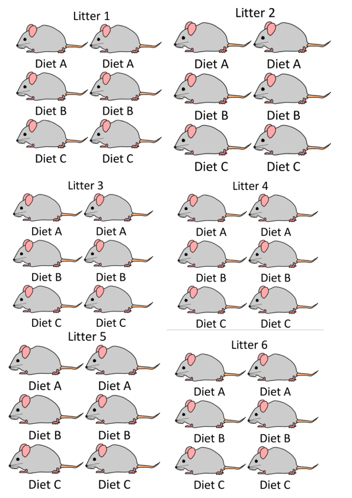
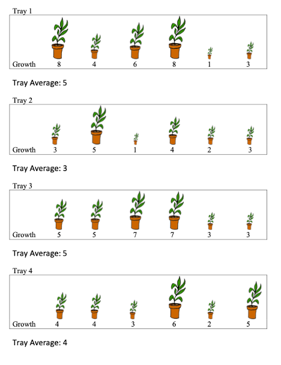
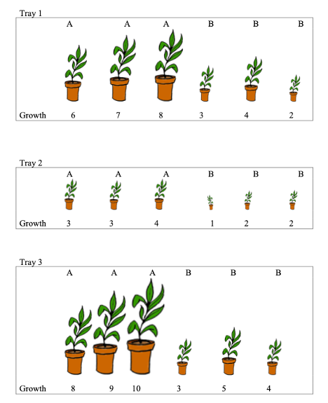

# Introduction to Correlated Data

**Chapter 2 Learning Outcomes**

6. Identify the response variable and fixed and random effects associated with a given set of data.      

7. Interpret parameter estimates, confidence intervals, and hypothesis tests associated with fixed effects in LME models.      

8. Interpret variance component estimates ($\sigma$ and $\sigma_u$) in linear mixed effects (LME) models.          

9. Compare the size of different variance component estimates given a LME model and a small set of data (i.e. say whether $\sigma_u$, or $\sigma$ will larger).        

10. Determine how standard errors in a LME model would compare to the standard errors we would get if we used a LLSR model on the same data.      

11. Determine how changes in sample size and/or experimental design will impact standard errors, confidence intervals, and p-values in a LME model.      

```{r}
library(tidyverse)
library(lme4)
library(lmerTest)
library(knitr)
```


## Introduction to Correlated Data


### Weight Gain in Mice: Experiment Design #1

Consider an experiment designed to assess the impact of three different diets on weight gain in mice. We observe six different litters of mice, with six mice in each litter. Within each litter, two mice are randomly assigned to each of the three diets. Researchers recorded the mean weight gain in each mouse over a four-week period. 

Experimental Design 1:

```{r, echo=FALSE, fig.cap="Mouse Experiment Version 1", out.width = '45%'}

```


### Mice Experiment 1 Data

```{r, echo=FALSE}
set.seed(02032021)
nlitters <- 6
ndiets <- 3
nreps <- 2
litter <- rep(1:nlitters, each=ndiets*nreps)
litter_mean <- rnorm(nlitters, 0.05, 0.05)
mouse_weight <- rep(litter_mean, each=ndiets*nreps)
diet <- rep(c("A","B","C"),nlitters*nreps)
diet_effect <- 0.009*(diet=="A") - 0.012*(diet=="B") 
weight_gain <- rnorm(nlitters*ndiets*nreps, mouse_weight + diet_effect, 0.01)
mice <- data.frame(litter, diet, weight_gain)   
```

The first 10 rows of the dataset look like this:


```{r}
head(mice,10)
```

### A Naive Graphical Analysis

Let's temporarily ignore the fact that some mice came from the same litter, and treat all observations as independent. 

The plot below shows the weight gain (or loss) for each of the mice, by diet. The red dots and connecting lines show the mean weight gain for each diet. 

The ensuing table shows the mean and standard deviation in weight gain for each of the three diets. 

```{r}
ggplot(data=mice, aes(x=factor(diet), y=weight_gain))  + geom_point()  + 
  stat_summary(fun="mean", geom="line", aes(group=factor(1)))  +
  stat_summary(fun="mean", geom="point", color="red", size=2)
```


**Question:**

Based on this graph, do you think there is evidence of diets have an effect on weight gain in mice? Why or why not?


### A More Informed Graphical Analysis   

So far, we've ignored the fact that some of the mice came from the same litter. Now, let's take litter into account. The figure below colors the mice by litter. 

The lines represent the average weight gain (or loss) in each litter. 

```{r}
ggplot(data=mice, aes(x=factor(diet), y=weight_gain, color=factor(litter))) + 
  geom_point() +  stat_summary(fun="mean", geom="line", aes(group=factor(litter)))
```

It may be helpful to examine each litter individually. 

```{r}
ggplot(data=mice, aes(x=factor(diet), y=weight_gain, color=factor(litter))) + 
  geom_point()  + 
  facet_grid(.~litter, scales = "free") + 
  stat_summary(fun="mean", geom="line", aes(group=factor(litter)))
```


**Question:** 

Based on the information about litters, do your thoughts about whether diets have an effect on weight gain in mice change? Does there appear to be stronger evidence of differences between groups? Weaker? Same?   


### Table of Mean Weight By Diet


```{r}
mouse_groups <- mice %>% group_by(diet)%>% 
  summarize(Mean_Weight=mean(weight_gain), SD_Weight = sd(weight_gain), N=n())
mouse_groups
```


### Table of Mean Weight By Diet and Litter

```{r}
mouse_groups <- mice %>% group_by(diet, litter)%>% 
  summarize(Mean_Weight=mean(weight_gain), SD_Weight = sd(weight_gain), N=n())
mouse_groups
```

Since each mouse in a litter received a different treatment, we can use the standard deviations between mice in the same litter to assess the amount of unexplained variability after accounting for litter and diet. 

Notice standard deviations are much smaller when we account for litter. Most of the unexplained variability in the first table is explained when we account for litter.  

When we fail to account for litter, variability thqt can be explained by differences between litters becomes conflated with unexplained variability. 

This causes us to overestimate unexplained variability and makes differences between groups look less meaningful than they really are. 

### Assessing Evidence of Differences

Conceptually, we can assess whether there is evidence of differences between the diets by considering differences in mean weights, relative to the amount of unexplained variability between mice in the same litter and on the same diet.  

Recall that when testing for a difference between two groups, a t-statistic is calculated using the formula

\[
t= \frac{\bar{x}_1-\bar{x}_2}{\textrm{SE}(\bar{x}_1-\bar{x}_2)}=\frac{\bar{x}_1-\bar{x}_2}{\sqrt{\frac{s_1^2}{n_1}+\frac{s_2^2}{n_2}}}
\]

The numerator measures the size of the differences between the groups, and the denominator measures the amount of unexplained variability between individuals in the same group. 


### An Improper Statistical Analysis

We've seen graphically, and in table form, how accounting for litter impacts our ability to discern differences between diets. Now, let's look at how this happens in a statistical model.   


If we ignore the fact that some mice are from the same litter, and wrongly treat them as independent, we might use an ordinary linear least squares regression model. 

```{r}
M_LLSR <- lm(data=mice, weight_gain~factor(diet))
summary(M_LLSR)$coefficients
```

The p-values on line 2 is large, indicating that there is not evidence of differences in weight gain between mice on diet 2, and the baseline diet (diet 1).  

The same is true for a comparison of diets 3 and 1, as seen on the third line.   

### A More Appropriate Statistical Analysis

The following command fits a linear mixed effects model (or multilevel model) that accounts for correlation between mice in the same litter. 

```{r}
M_LME <- lmer(data=mice, weight_gain~factor(diet) + (1 | factor(litter)))
summary(M_LME)$coeff
```

* Estimates are unchanged, but standard errors decrease by a factor of almost 10.   
* t-statistics are now high, and p-values low, indicating differences between the diets     

Just as we saw graphically, and in tables, accounting for differences between litters allows us to accurately quantify unexplained variability, and assess whether there is evidence of differences in weight gain between the diets.   

## Linear Mixed Effects Models

### LLSR Model for Mice Experiment


Let $Y_{ij}$ denote the weight gain of mouse $j$ in litter $i$. $j=1,2,\ldots, 6$, $j=1,2,\ldots, 6$.  

In an ordinary linear least squares regression model, we assume that:   

* each diet has an expected (or average) weight gain    
* individual mice vary from their expected weights randomly, according to normal distributions with constant variance $\sigma^2$     
* no two mice are any more or less alike than any others, except for diet (which is not true in this context)

A model would have the form:

\[
Y_{ij}  = \beta_{0}+\beta_{1}\textrm{DietB}_{ij} +\beta_{2}\textrm{DietC}_{ij} + \epsilon_{ij},
\]

where $\epsilon_{ij} \sim\mathcal{N}(0, \sigma^2)$.  


Examples: 

| | Diet|  Expected Weight | Random Deviation | 
|------------------------------|:----|:------|:---------------|:--------------|
| Litter 1, Mouse 1 | A | $\beta_0$ | $\epsilon_{11}$|   
| Litter 1, Mouse 3 | B | $\beta_0 + \beta_1$ |  $\epsilon_{13}$ |
| Litter 1, Mouse 5 | C | $\beta_0 + \beta_2$ | $\epsilon_{15}$ |
| Litter 2, Mouse 1 | A | $\beta_0$ | $\epsilon_{21}$|   
| Litter 2, Mouse 3 | B | $\beta_0 + \beta_1$ |  $\epsilon_{23}$ |
| Litter 2, Mouse 5 | C | $\beta_0 + \beta_2$ | $\epsilon_{25}$ |


### Model Accounting For Correlation 

Let $Y_{ij}$ denote the weight gain of mouse $j$ in litter $i$. $j=1,2,\ldots, 6$, $j=1,2,\ldots, 6$.  

We assume that:   

* expected (or average) weight gain differs between diets      
* individual litters vary from their expected weight randomly, according to normal distributions with constant variance $\sigma^2_l$   
* within each litter, individual mice vary from their expected weights randomly, according to normal distributions with constant variance $\sigma^2$    


A model would have the form:

\[
Y_{ij}  = \beta_{0}+\beta_{1}\textrm{DietB}_{ij} +\beta_{2}\textrm{DietC}_{ij} + l_{i} + \epsilon_{ij},
\]

where $l_i\sim\mathcal{N}(0, \sigma^2_l)$, and $\epsilon_{ij} \sim\mathcal{N}(0, \sigma^2)$.  


| | Diet|  Expected Weight | Random Deviation | 
|------------------------------|:----|:------|:---------------|:--------------|
|Litter 1, Mouse 1 | A |  $\beta_0$ | $l_1 + \epsilon_{11}$|   
|Litter 1, Mouse 3 | B |  $\beta_0 + \beta_1$ | $l_1 + \epsilon_{13}$|   
|Litter 1, Mouse 5  | C |  $\beta_0 + \beta_2$ | $l_1 + \epsilon_{15}$|   
|Litter 2, Mouse 1  | A |  $\beta_0$ | $l_2 + \epsilon_{21}$|   
|Litter 2, Mouse 3  | B |  $\beta_0 + \beta_1$ | $l_2 + \epsilon_{23}$|   
|Litter 2, Mouse 5  | C |  $\beta_0 + \beta_2$ | $l_2 + \epsilon_{25}$|   


### Questions of Interest

The model 

\[
Y_{ij}  = \beta_{0}+\beta_{1}\textrm{DietB}_{ij} +\beta_{2}\textrm{DietC}_{ij} + l_{i} + \epsilon_{ij},
\]

where $l_i\sim\mathcal{N}(0, \sigma^2_l)$, and $\epsilon_{ij} \sim\mathcal{N}(0, \sigma^2)$

has 5 parameters:

* $\beta_0$ - average weight gain for mice on diet A.    
* $\beta_1$ - difference in average weight gain for mice on diet B, compared to to diet A    
* $\beta_2$ - difference in average weight gain for mice on diet C, compared to to diet A    
* $\sigma_l$ - standard deviation in the distribution of differences between litters (i.e. variability explained by litter)     
* $\sigma$ - standard deviation in the distribution of differences between individual mice in the same litter (i.e. unexplained variability)      


Thus, for a mouse on Diet A, the expected weight gain follows a normal distribution with mean $\beta_0$ and variance $\sigma^2_l + \sigma^2$.    

For a mouse on Diet C, the expected weight gain follows a normal distribution with mean $\beta_0 + \beta_2$ and variance $\sigma^2_l + \sigma^2$  

This is based on the fact that the sum of two independent normal random variables is normal, with mean equal to the sum of the means and variance equal to the sum of the variances.   


### Fixed and Random Effects    

In this case, we want to test for whether there are differences in weight gain between the diets. 

There is no reason to test for differences in weight gain between the litters. Differences between these specific litters of mice are not important to us. We're not interested in drawing conclusions about these specific mice. They're just a sample of participants, being used to investigate the diets. It's likely that we'll never acually see these specific litters of mice beyond this study.   

We still need to account for litter, though, because it helps explain, or account for, variability that would otherwise go unexplained.    

* Variables for which we want to investigate differences or relationships are called **fixed effects**. We should build these into the "expectation structure" of the model, using $\beta_j$'s.   
* Variables that we are not interested in testing for differences or relationships between, but that we still want to include in our model in order to account for correlation and explain variability are called **random effects.** We should add these to the model as normally distributed error terms.    
* Accounting for random effects allows us to accurately calculate standard errors associated with fixed effects.    
* A model that involves both fixed and random effects is called a **linear mixed effects model**.    


### Fitting the Model in R    

To fit a linear mixed effects model in R, we use the `lmer()` command that is part of the `lme4` package. It is also helpful to load the `lmerTest` package, in order to obtain p-values in the output.   
  

To add a random effect for a variable add `(1 | variable_name)` in the model.   

```{r}
M_LME <- lmer(data=mice, weight_gain~factor(diet) + (1 | factor(litter)))
summary(M_LME)
```

**Estimates and Interpretations**    

* $\beta_0 = 0.058$: We estimate that average weight gain for Diet A is 0.058 g.    
* $\beta_1 = -0.024$: We estimate that mice on diet B gain 0.024 g. less than mice on diet A, on average.   
* $\beta_2 = -0.011$: We estimate that mice on diet C gain 0.011 g. less than mice on diet A, on average.    

The "Random effects" table gives estimates of $\sigma^2_l$ (litters) and $\sigma^2$ (Residual).  

* $\sigma_l = 0.061$: We estimate that the standard deviation in differences in weights between litters, after accounting for diet, is 0.061 g.       
* $\sigma = 0.007$: We estimate that the standard deviation in differences in weights between mice within a litter, after accounting for diet, is 0.007 g.    

There is evidence of differences between the diets.  
There is more variability in weight between different litters than between mice in the same litter, after accounting for diet.   


### Why Not Fixed Effect for Litter?

Why would a model like the following, which uses litter as an expanatory variable in Example 1, not be very useful?

```{r}
M_fixed_litter <- lm(data=mice, weight_gain~ factor(diet) + factor(litter))
summary(M_fixed_litter)
```

We're now estimating 8 $\beta's$ instead of 3. 

Each time we estimate an additional parameter, we lose a degree of freedom, making estimates and predictions less precise. 

We don't care about differences between the litters, so $\beta_3, \beta_4, \ldots, \beta_7$ are not useful.  

Imagine if we had many more litters. Things would get really messy, and unnecessarily so.   

If, for some reason, we really wanted to test for differences in weight gain between these specific litters of mice, then we would treat them as fixed effects, but it's hard to see why we would want to do that.   


## A Second Mice Experiment 

### Weight Gain in Mice: Experiment 2

Now consider a different structure of the mouse experiment. 

In this version of the experiment, the three diets were randomly assigned to six pregnant mice, so that two mice were assigned to each diet. Each of the six mice (dams), gave birth to six pups, creating six litters of six, as seen before. Researchers the observed the mean weight gain of the pups over a four week period.   

Now, each pup in a litter has necessarily been assigned to the same diet, since diets were assigned to the dams, before the pups were born. 

Experimental Design 2:

```{r, echo=FALSE, fig.cap="Mouse Experiment Version 2", out.width = '75%'}
knitr::include_graphics("Mice2.png")
```

### Mice Experiment 2 Data

```{r, echo=FALSE}
set.seed(02032021)
nlitters <- 6
ndiets <- 3
nreps <- 2
litter <- rep(1:nlitters, each=ndiets*nreps)
litter_mean <- rnorm(nlitters, 0.05, 0.05)
mouse_weight <- rep(litter_mean, each=ndiets*nreps)
diet <- rep(c("A", "B", "C"), each = nlitters*nreps)
diet_effect <- 0.009*(diet=="A") - 0.012*(diet=="B") 
weight_gain <- rnorm(nlitters*ndiets*nreps, mouse_weight + diet_effect, 0.01)
mice2 <- data.frame(litter, diet, weight_gain) 
```

The first 15 rows of the dataset look like this:

```{r}
head(mice2,15)
```

### A Naive Graphical Analysis for Experiment 2

Again, we'll temporarily ignore the fact that mice come from the same litter and treat all observations as independent. 


```{r}
ggplot(data=mice2, aes(x=factor(diet), y=weight_gain))  + geom_point()  + 
  stat_summary(fun="mean", geom="line", aes(group=factor(1)))+  
  stat_summary(fun="mean", geom="point", color="red", size=2)
```


###  A More Informed Graphical Analysis for Experiment 2

Now, we'll account for the fact that mice in the same litter got the same diets. The plot below adds color to show litter.  

```{r}
ggplot(data=mice2, aes(x=factor(diet), y=weight_gain, color=factor(litter))) + geom_point() 
```

Since diets were assigned to litters, not individual mice, it is the litters we should be comparing. 

When comparing diets, our observational units are litters, not individual mice. Since there are only 6 litters, our sample size is 6, rather than 36.   

Thus, the best graphical analysis would come from the following plot, which displays average weight for each litter:

```{r}
Litters <- mice2 %>% group_by(diet, litter)%>% 
  summarize(mean_weight_gain=mean(weight_gain), N=n())
head(Litters)
```


```{r}
ggplot(data=Litters, aes(x=factor(diet), y=mean_weight_gain, color=factor(litter))) + geom_point() 
```

###  Table of Mean Weight By Diet for Experiment 2

```{r}
mouse_groups <- mice2 %>% group_by(diet)%>% 
  summarize(Mean_Weight=mean(weight_gain), SD_Weight = sd(weight_gain), N=n())
mouse_groups
```

This standard deviations in this table pertain to variability between the 12 mice that got each diet (6 from one litter and 6 from another).  

These are not useful here, since diets were assigned to litters, not individual mice.  

### Table Comparing Litters Means by Diet for Experiment 2   

We now look at means and standard deviations between litter means, using the average rate in each litter as the response variable.  

```{r}
litter_groups <- Litters %>% group_by(diet)%>% 
  summarize(Mean_Weight=mean(mean_weight_gain), SD_Weight = sd(mean_weight_gain), N=n())
litter_groups
```


### An Inappropriate Model for the Second Design

An ordinarly linear least squares regression model fails to account for the fact that treatments were assigned to litters, not mice. It is based on the assumption that we have 36 independent mice (which is incorret).    

Such a model would have the form

\[
Y_{ij}  = \beta_{0}+\beta_{1}\textrm{DietB}_{ij} +\beta_{2}\textrm{DietC}_{ij} + \epsilon_{ij},
\]


Output for such a model is shown below.   


```{r}
M2_LLSR <- lm(data=mice2, weight_gain~factor(diet))
summary(M2_LLSR)
```


### A More Appropriate Model for Experiment 2

A linear mixed effects model with a random term for litter accounts for the fact that treatments were applied to litters, not individual mice. This model has the form:   

\[
Y_{ij}  = \beta_{0}+\beta_{1}\textrm{DietB}_{ij} +\beta_{2}\textrm{DietC}_{ij} + l_{i} + \epsilon_{ij},
\]

where $l_i\sim\mathcal{N}(0, \sigma^2_l)$, and $\epsilon_{ij} \sim\mathcal{N}(0, \sigma^2)$


Output for a model that accounts for correlation between mice in the same litter is shown.   

```{r}
M2_LME <- lmer(data=mice2, weight_gain~factor(diet) + (1 | factor(litter)))
summary(M2_LME)
```

* Estimates are the same     
* Standard errors are larger, due mostly to the fact that our sample size is 6, instead of 36    

* after accounting for diet, standard deviation in weights between litters is estimated to be 0.0629 g. (estimate of $\sigma_l$)     
* after accounting for diet, standard deviation in weights between mice in the same litter is estimated to be 0.0071 g. (estimate of $\sigma$)     


### Model for Litter Means

Alternatively, we could fit a model, using the 6 litters as our observations, with the mean weight in each litter as the response variable. If we now let $Y_i$ represent the mean weight in litter i, our model has the form:   

\[
Y_{i}  = \beta_{0}+\beta_{1}\textrm{DietB}_{i} +\beta_{2}\textrm{DietC}_{i} + \epsilon_{i},
\]

where  $\epsilon_{i} \sim\mathcal{N}(0, \sigma^2)$

Since it is reasonable to assume that litters are independent, we could use an ordinary LLSR model in this context. 

```{r}
M2_Means <- lm(data=Litters, mean_weight_gain~factor(diet))
summary(M2_Means)
```

* Estimates, standard errors, and p-values are identical to the ones seen in the mixed-effects model.    


### Fixed Effect for Litter in Experiment 2

If we try to treat litter as a fixed effect in Experiment 2, we would not even be able to estimate all of the parameters.  

```{r}
M2_fixed_litter <- lm(data=mice2, weight_gain~ factor(diet) + factor(litter))
summary(M2_fixed_litter)
```

## A Multilevel Experiment

### Experiment 2 Illustration

In example 2, we saw that treatments (diets) were assigned to litters (dams), but measurements were taken on the individual mice (pups).    

```{r, echo=FALSE,  out.width = '60%'}
knitr::include_graphics("Multi.png")
```

### Experiment with Variables Assigned at Different Levels   

Now imagine an experiment with the following setup     

* diets are still assigned to dams, prior to the birth of the pups, so all mice in the same litter get the same diet      
* within each litter three mice are given nutritional supplements after their birth and the other three are not    

We want to study the effect of diet and supplement on weight gain.  

```{r, echo=FALSE, out.width = '60%'}
knitr::include_graphics("Mice3.png")
```


One treatment (diet) is assigned to litters, while the other (supplement) is assigned to individual mice.   


```{r, echo=FALSE, out.width = '60%'}
knitr::include_graphics("Multi2.png")
```

* For the purpose of comparing diets, our observational units are 6 independent litters.   
* For the purpose of comparing supplements, our observational units are 36 individual mice (who are not independent)

An experiment where treatments are assigned at different levels is called a **multilevel experiment**     

* level 1 observational units are mice, and level 1 treatment is supplement    
* level 2 observational units are litters, and level 2 treatment is diet   


### Experiment 3 Data

```{r, echo=FALSE}
set.seed(02032021)
nlitters <- 6
ndiets <- 3
nreps <- 2
litter <- rep(1:nlitters, each=ndiets*nreps)
litter_mean <- rnorm(nlitters, 0.05, 0.05)
mouse_weight <- rep(litter_mean, each=ndiets*nreps)
diet <- rep(c("A", "B", "C"), each = nlitters*nreps)
diet_effect <- 0.009*(diet=="A") - 0.012*(diet=="B") 
supplement <- rep(c(1,0),18)
supplement_effect <- 0.002*supplement
weight_gain <- rnorm(nlitters*ndiets*nreps, mouse_weight + diet_effect+supplement_effect, 0.01)
mice3 <- data.frame(litter, diet, supplement, weight_gain) 
```

```{r}
head(mice3,15)
```


###  Graphical Analysis for Experiment 3

We use color to represent litter, and shape to represent supplement. We'll use the argument `position=position_jitterdodge()` to stagger litters and supplement levels, which avoids overlap and makes the graph easier to read.  

```{r}
ggplot(data=mice3, aes(x=factor(diet), y=weight_gain, color=factor(litter), 
       shape=factor(supplement))) + geom_point(position=position_jitterdodge())
```


### An Inappropriate Model for the 3rd Design

An ordinarly linear least squares regression model fails to account for the fact that treatments were assigned to litters, not mice. It is based on the assumption that we have 36 independent mice (which is incorret).    

The model has the form

\[
Y_{ij}  = \beta_{0} + \alpha\textrm{Supplement}_i + \beta_{1}\textrm{DietB}_{ij} +\beta_{2}\textrm{DietC}_{ij}  + \epsilon_{ij},
\]

where $\epsilon_{ij} \sim\mathcal{N}(0, \sigma^2)$


Output for such a model is shown below.   


```{r}
M3_LLSR <- lm(data=mice3, weight_gain~supplement + factor(diet))
summary(M3_LLSR)
```


### A More Appropriate Model for Experiment 3

We instead fit a linear mixed effects model. 

Since we want to study the effects of diet and supplement, we treat supplement and diet as fixed effects.   

Since we want to account for correlation due to mice being in the same litter, we treat litter as a random effect. 

Our model has the form

\[
Y_{ij}  = \beta_{0} + \alpha\textrm{Supplement}_i + \beta_{1}\textrm{DietB}_{ij} +\beta_{2}\textrm{DietC}_{ij} + l_{i} + \epsilon_{ij},
\]

where $l_i\sim\mathcal{N}(0, \sigma^2_l)$, and $\epsilon_{ij} \sim\mathcal{N}(0, \sigma^2)$


Output for a model that accounts for correlation between mice in the same litter is shown.   

```{r}
M3_LME <- lmer(data=mice3, weight_gain ~ supplement + factor(diet) + (1 | factor(litter)))
summary(M3_LME)
```

**Interpretations**     

Interpretations for fixed effects are the same as in LLSR.

* We expect mice on the supplement to gain 0.008 g. more than mice not on the supplement, assuming they get the same diet.    
* We expect mice in diet B to gain 0.02 g. more than mice on diet A, assuming supplement is held constant.    
* We expect mice in diet C to gain 0.07 g. more than mice on diet A, assuming supplement is held constant

* After accounting for differences in diet and supplement, the standard deviation in weights between litters is estimated to be 0.063 g. (an estimate of $\sigma_l$). 
* After accounting for differences in diet and supplement, the standard deviation in weights between mice in the same litter is estimated to be 0.00638 g. (an estimate of $\sigma$). 


### Comparison of LLSR and LME Models   

Compared to the incorrect LLSR model, when we use the linear mixed effects model:     

* estimates for fixed effects supplement and diet do not change     
* standard error for supplement is smaller - we get a more precise comparison for supplements because the model has accounted for variability due to differences in litters     
* standard error for diet is larger - since diets were assigned to litters, our sample size is 6, not 36, so standard errors are higher       

The mixed effects model suggests evidence of differences due to supplement, but not evidence of differences due to diet. This is the opposite of the incorrect LLSR model.   

## Practice Questions

```{r, echo=FALSE}
plants <- read_csv("Plants.csv")
```

```{r, echo=FALSE}
plants2 <- read_csv("Plants2.csv")
```

**Refer to the following scenarios to answer the questions in this section.**    


**Scenario 1**   

An experiment was conducted to compare the effects of two different fertilizers on plants. Twelve plants were grown in each of eight trays, for a total of 96 plants. Fertilizers were randomly assigned to entire trays, so that all plants in a tray received the same fertilizer, and each fertilizer was used on four different trays. The amount of fertilizer applied to each plant (in ounces) also varied between trays. Two trays received 2, oz, two received, 4 oz, two received 6 oz, and two received 8 oz. Plants in the same tray received the same amount of fertilizer. (See the diagram for an illustration.) The growth of each plant (in cm.) over a two week period was recorded.  

**Scenario 1 Illustration**    

The diagram shows values of the explanatory variables, brand and amount, but not the response variable, growth.   

```{r, echo=FALSE, fig.cap="Plant Experiment Scenario 1", out.width = '75%'}
knitr::include_graphics("Plants1.png")
```

The first few rows of the data are shown below. 

```{r}
head(plants)
```

A scatterplot showing growth by amount of fertilizer, brand, and tray is shown below. 

```{r, fig.cap="Scenario 1"}
ggplot(data=plants, aes(x=amount, y=growth, shape=factor(brand), color=factor(tray))) + geom_point() 
```

**Scenario 2**    

Now consider a different version of the experiment in Question 2. In this version, the plants are planted in separate plots, which are then placed in the 8 trays. All 12 plants in each tray still receive the same brand of fertilizer, but the amount applied is randomly assigned to pots, so that within each tray, three pots get 2 oz, three get 4 oz, three get 6 oz, and three get 8 oz. (See illustration).    


**Scenario 2 Illustration**    

The diagram shows values of the explanatory variables, brand and amount, but not the response variable, growth.   


```{r, echo=FALSE, fig.cap="Plant Experiment Scenario 2", out.width = '75%'}
knitr::include_graphics("Plants2.png")
```


The first few rows of the data are shown below. 

```{r}
head(plants2)
```

A scatterplot showing growth by amount of fertilizer, brand, and tray in Scenario 2 is shown below. 


```{r, fig.cap="Scenario 2"}
ggplot(data=plants2, aes(x=amount, y=growth, shape=factor(brand), color=factor(tray))) + geom_point() 
```


### 7. Identify the response variable and fixed and random effects associated with a given set of data.   {-}

Identify the response variable and all fixed and random effects in scenarios 1 and 2.   


### 8. Interpret variance component estimates ($\sigma$ and $\sigma_u$) in linear mixed effects (LME) models.    {-}

Let $Y_{ij}$ represent growth of plant $j$ in tray $i$. We will work with a random effects model of the form: 

\[
Y_{ij}  = \beta_{0}+\beta_1\textrm{Brand2}_{ij} + \alpha\textrm{Amount}_{ij} + t_{i} + \epsilon_{ij},
\]

 where $t_i\sim\mathcal{N}(0, \sigma^2_t)$, and $\epsilon_{ij} \sim\mathcal{N}(0, \sigma^2)$.  

**a)** Explain, in words what $\sigma$ and $\sigma_t$ represent in this model.   

**b)** 

R output for a linear mixed effects model for scenario 1 is shown below.   

```{r}
M1 <- lmer(data=plants, growth ~ factor(brand) + amount + (1|tray))
summary(M1)
```

Give the estimates of $\sigma$ and $\sigma_u$. Which is bigger and what does that tell us?    


### 10. Determine how standard errors in a LME model would compare to the standard errors we would get if we used a LLSR model on the same data.   {-} 
  

**a)** 

In each of scenarios 1 and 2, suppose we inappropriately fit a LLSR model of the form  
\[
Y_{ij}  = \beta_{0}+\beta_1\textrm{Brand2}_{ij} + \alpha\textrm{Amount}_{ij}  + \epsilon_{ij}. 
\]

to the same data. For each scenario, state whether the standard errors associated with brand and amount would increase, decrease, or stay the same. How would this affect the p-value and the amount of evidence of effects associated with these variables?    


**b)** 

For the data in Scenario 1, we now create a dataset grouped by tray, with the average growth displayed for each tray. The data are displayed below.      

```{r}
plants_summary <- plants %>% group_by(tray) %>% summarize(brand=mean(brand),
                                                          amount=mean(amount),
                                                          growth=mean(growth), 
                                                          N=n())
plants_summary
```

If we fit a linear least squares regression model with brand and amount as explanatory variables, how would the estimates, standard errors, and p-values compare to those obtained from the LME model for Scenario 1?    

**c)** 

Explain why it would not make sense to group the data by tray and fit a LLSR model in scenario 2?    


### 11. Determine how changes in sample size and/or experimental design will impact standard errors, confidence intervals, and p-values in a LME model. {-}      

**a)** 

In Scenario 1, explain why it is inappropriate to think of our sample size as being 96 plants in this scenario. What are the appropriate observational units, and what is the relevant sample size for determining the effects of brand and amount?    

**b)** 

In Scenario 2, what is the relevant sample size associated with brand variable? What about the amount variable?     

**c)** 

Consider the experimental designs in Questions 1 and 2. If you were designing the experiment and could choose either design, at equal cost, which would you choose? Why?


### 9. Compare the size of different variance component estimates given a LME model and a small set of data (i.e. say whether $\sigma_u$, or $\sigma$ will be larger).    {-}      

**a)** 

Consider the simplified version of the plant experiment shown below. Here, there are no fixed effects, and we simply seek to estimate the average height of the plants and measure the amount of variability associated with plants and trays. **Now note that unlike the previous diagrams, the values of the response variable, growth, are shown.**   

```{r, echo=FALSE, out.width = '75%'}

```

Let $Y_{ij}$ represent growth of plant $j$ in tray $i$. (i=1, \ldots, 4 and j=1, \ldots, 6). We will work with a random effects model of the form: 

\[
Y_{ij}  = \beta_{0} + t_{i} + \epsilon_{ij},
\]

 where $t_i\sim\mathcal{N}(0, \sigma^2_t)$, and $\epsilon_{ij} \sim\mathcal{N}(0, \sigma^2)$.  
 
Will $\sigma_t$ or $\sigma$ be larger? Explain your answer. (Don't actually try to calculate these, just answer based on the information given in the diagram)      


**b)** 

Answer the same question as in (a), for the following data. In this scenario, there are only 3 trays.    

```{r, echo=FALSE, out.width = '75%'}
knitr::include_graphics("Plantsb.png")
```


**c)** 

Now, suppose 3 plants in each tray receive fertilizer brand A and 3 receive fertilizer brand B. The fertilizer brands are shown in the plots below.    

Consider Model 1 below, fit to data shown underneath it. State whether $\sigma_t$ or $\sigma$ will be larger? Explain your answer.

Let $Y_{ij}$ represent growth of plant $j$ in tray $i$. 

**Model 1:**    

\[
Y_{ij}  = \beta_{0} + t_{i} + \epsilon_{ij},
\]

 where $t_i\sim\mathcal{N}(0, \sigma^2_t)$, and $\epsilon_{ij} \sim\mathcal{N}(0, \sigma^2)$.  
 

```{r, echo=FALSE, out.width = '75%'}

```

**b)**

Now suppose that Model 2 is fit to the same data. State whether $\sigma_t$ or $\sigma$ will be larger? Explain your answer.

 
**Model 2:**    

\[
Y_{ij}  = \beta_{0} + \beta_1\text{BrandB}_{ij} + t_{i} + \epsilon_{ij},
\]

where $t_i\sim\mathcal{N}(0, \sigma^2_t)$, and $\epsilon_{ij} \sim\mathcal{N}(0, \sigma^2)$.  

