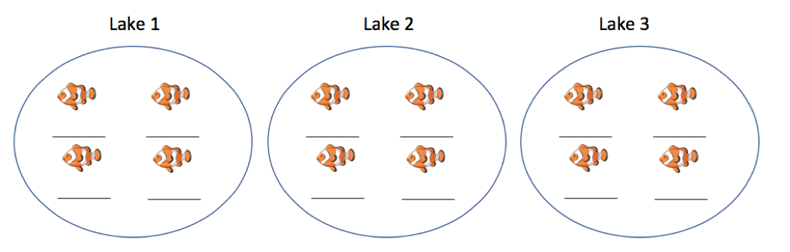
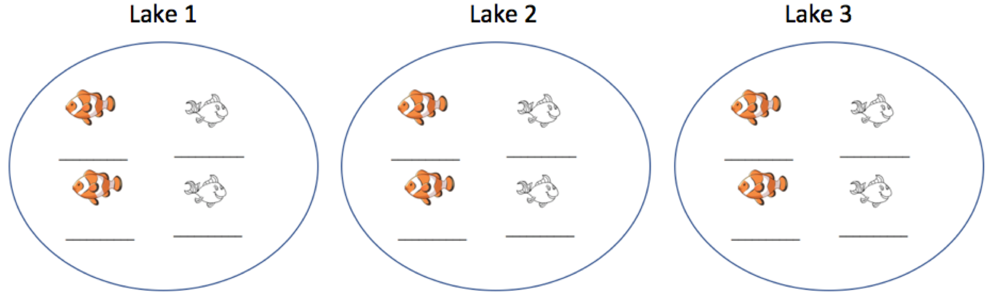

# Multilevel Models

**Chapter 3 Learning Outcomes**

12. Identify the levels of a two-level experiment and the observational units and variables at each level.    

13. Interpret random slopes, intercepts, error terms and their estimated variances and correlations in linear mixed effects models.    

14. Determine whether it is appropriate to add a random slope term to a model in a given context.

15. Distinguish between random slope terms and interactions terms and explain what the inclusion/exclusion of each in a LME model says about our assumptions regarding the nature of our data.     

16. Calculate expected responses and expected changes associated with fixed effects in a LME model.    

17. Write equations for linear mixed effects models in mathematical notation, including assumptions about distributions of random effects and error terms.     

18. Give examples of values of the response variable that would satisfy given conditions about parameters in a LME model (for example ($\sigma_u>\sigma$)).  

19. Analyze data using a multilevel linear mixed effects model in R.    


```{r setup, include=FALSE}
knitr::opts_chunk$set(echo = TRUE, message=FALSE, warning=FALSE, fig.width = 6, fig.height = 3)
```

These notes provide a summary of Chapter 8 in [Beyond Multiple Linear Regression](https://bookdown.org/roback/bookdown-BeyondMLR/) by Roback and Legler. Much of the code that appears here comes from the textbook's [Github repository](https://github.com/proback/BeyondMLR/). 


```{r}
# Packages required for Chapter 8
library(MASS)
library(gridExtra)  
library(mnormt) 
library(lme4) 
library(lmerTest)
library(knitr) 
library(kableExtra)
library(tidyverse)
```

## Music Performance Anxiety Study: Data and Exploratory Analysis

### Description of the Study

A study by Miller (2010) examined the emotional state of musicians before performances and factors that might affect their emotional state. 

* data on 497 different performances by 37 different performers     
* performers completed Positive Affect Negative Affect Schedule (PANAS) before each performance, measuring characteristics of anxiety and happiness before performing      
* we are interested in whether there are relationships between performance anxiety and characteristics such as performance type (solo, large ensemble, or small ensemble); audience (instructor, public, students, or juried); if the piece was played from memory; age; gender; instrument (voice, orchestral, or keyboard); and, years studying the instrument      
* also have information on personalities of musicians, obtained through through the Multidimensional Personality Questionnaire (MPQ), which provided scores for absorption positive emotionality (PEM---a composite of well-being, social potency, achievement, and social closeness); negative emotionality (NEM---a composite of stress reaction, alienation, and aggression); and, constraint (a composite of control, harm avoidance, and traditionalism).     

### Variables

We focus on the following variables:

- `id` = unique musician identification number
- `diary` = cumulative total of diaries filled out by musician
- `perf_type` = type of performance (Solo, Large Ensemble, or Small Ensemble)
- `audience` = who attended (Instructor, Public, Students, or Juried)
- `memory` = performed from Memory, using Score, or Unspecified
- `na` = negative affect score from PANAS
- `gender` = musician gender
- `instrument` = Voice, Orchestral, or Piano
- `mpqab` = absorption subscale from MPQ
- `mpqpem` = positive emotionality (PEM) composite scale from MPQ
- `mpqnem` = negative emotionality (NEM) composite scale from MPQ

### The Data

```{r}
#Getting started
music = read.csv("https://raw.githubusercontent.com/proback/BeyondMLR/master/data/musicdata.csv")
head(music,10)       # examine first 10 rows
```

```{r}
dim(music)        # should be 497 x 18
```

[Full Dataset](https://github.com/proback/BeyondMLR/blob/master/data/musicdata.csv)


### Some Data Wrangling

We'll select variables we're interested in working with.

```{r}
select <- dplyr:: select
keydata <- music %>% 
  dplyr::select(id, diary, perform_type, memory, audience, 
      na, gender, instrument, mpqab, mpqpem, mpqnem)
head(keydata)
```


### Multilevel Structure

Note that we have multiple observations on the same musicians Since observations on the same musician will be correlated, we need to use a multilevel model with a random effect for musician. 

**Level One Variables:** are those measured at the most frequently occurring observational unit (the 497 performances)       
                - negative affect (our response variable)
                - performance characteristics (type, audience, if music was performed from memory)
                - number of previous performances with a diary entry

**Level Two Variables:** are those measured on larger observational units (the musicians)
              - demographics (age and gender of musician)
              - instrument used and number of previous years spent studying that instrument
              - baseline personality assessment (MPQ measures of positive emotionality, negative emotionality, constraint, stress reaction, and absorption)

### Questions of Interest     

* Do musicians playing orchestral instruments experience different levels or performance anxiety than those playing keyboard instruments or vocalists?     

* Does playing in a large ensemble (as opposed to a small group or solo performance) have an impact on performance anxiety? 


* Does the type of audience impact performance anxiety?   

* Does performance anxiety decrease with experience?      

* Are measures of the musician's attitude/personality, such as positive emotions, negative emotions, and absorption associated with performance anxiety?   

* For a single musician, is the amount of performance anxiety consistent across performances, or does it vary from one performance to the next?  


### Number of Performances by Musician

When creating graphical summaries of level one covariates (variables) it is helpful to plot both 1) the 497 observations individually, and 2) averages for each of the 37 individuals, averaging across performances. 

Number of performances by each musician:

```{r}
# number of diary entries for each subject
music %>% count(id)     
```

### Number of Performances of Each Type

We summarize level one covariates, ignoring the fact that there are multiple observations on the same musicians. 

```{r}
# Exploratory data analysis
# Summarize Level 1 covariates (and responses) by 
# ignoring within subject correlation and pretending 
# all observations are independent
music %>% count(perform_type) 
```


```{r}
music %>% count(audience) 
```

### Distribution of Negative Affect for All Performances

We display the distribution of the response variable (negative affect) across all 497 performances. 

```{r}
# create ggplot theme for plots
# theme with grid, grey background 
theme.1 <- theme(axis.title.x = element_text(size = 14),
  axis.title.y = element_text(size = 14),
  plot.title=element_text(hjust=.9,face="italic",size=12))
## Histogram of negative affect frequencies
na.all <- ggplot(data=music,aes(x=na)) + 
  geom_histogram(binwidth = 2, fill = "white",color = "black") + 
  theme.1 + xlim(10,35) +
  xlab("Negative Affect") + ylab("Frequency") + labs(title="(a)") 
na.all
```

### Distribution of Average Negative Affect for each Musician

We also create a level two dataset, containing the average negative affect across all of the musician's performances. 

```{r}
# Create Level2 data set by picking off one observation 
# per subject, which would be easier if every subject 
# had a diary entry labeled '1' - should be 37 rows 
# and 6 columns (one per L2 variable)
music.lev2 <-  keydata %>%
  group_by(id) %>%
  filter(row_number() == 1) %>%
  select(id, gender:mpqnem)
# Add average across all performances for each subject 
# for EDA plots
meanbysubj <- music %>% group_by(id) %>%
  summarise(meanbysubj = mean(na, na.rm = TRUE))
music.lev2 <- music.lev2 %>%
  left_join(meanbysubj, by = "id")
head(music.lev2)
```

We display the mean negative affect scores for each of the 37 musicians. 

```{r}
na.mean <- ggplot(data=music.lev2,aes(x=meanbysubj)) + 
  geom_histogram(binwidth = 2, fill = "white", 
                 color = "black") + 
  theme.1 + xlim(10,35) +
  xlab("Mean Negative Affect") + ylab("Frequency") + labs(title="(b)") 
na.mean
```

### Distribution of Level Two Covariates

We examine the  distribution of level 2 covariate instrument type (obtained from first performance by each musician, since these will be the same for all performances). 


```{r}
music.lev2 %>% ungroup(id) %>% count(instrument)
```

### Distributions of NEM, PEM, Absorption

```{r fig.width=9}
nem1 <- ggplot(data=music.lev2,aes(x=mpqnem)) + 
  geom_histogram(binwidth = 5, fill = "white",
                 color = "black") + 
  theme.1 + 
  xlab("NEM") + ylab("Frequency") + labs(title="(a)")
pem1 <- ggplot(data=music.lev2,aes(x=mpqpem)) + 
  geom_histogram(binwidth = 5, fill = "white", 
                 color = "black") + 
  theme.1 + 
  xlab("PEM") + ylab("") + labs(title="(b)")
abs <- ggplot(data=music.lev2,aes(x=mpqab)) + 
  geom_histogram(binwidth = 5, fill = "white", 
                 color = "black ") + 
  theme.1 + 
  xlab("Absorption") + ylab("") + labs(title="(c)")
grid.arrange(nem1,pem1,abs,ncol=3)
```

### Negative Affect by Performance Type, Audience Type, and Previous Performances

Boxplots of two categorical Level One covariates (performance type (a) and audience type (b)) vs. model response, and scatterplot of one continuous Level One covariate (number of previous diary entries (c)) vs. model response (negative affect).  Each plot contains one observation for each of the 497 performances.

```{r, fig.height=4, fig.width=8}
# Look at relationships among Level 1 covariates and 
# primary response (again ignoring correlation).  
# Boxplots for categorical covariates and
# scatterplots and lattice plot for continuous covariates.
# boxplot of negative affect by performance type
box.perform <- ggplot(data=music,aes(factor(perform_type),na)) +
  geom_boxplot() + 
  theme.1 + coord_flip() + ylab("Negative affect") + 
  xlab("") + labs(title="(a) Negative Affect by Instrument Type")
# boxplot of negative affect by audience
box.audience <- ggplot(data=music,aes(factor(audience),na)) +
  geom_boxplot() +
  theme.1 + coord_flip() +  ylab("Negative affect") + 
  xlab("") + labs(title="(b) Negative Affect by Performance Type")
# scatterplot of negative affect versus number of 
# previous performances
scatter.previous <- ggplot(data=music, aes(x=previous,y=na)) +
  geom_point() + 
  theme.1 + 
  geom_smooth(method="lm",color="black") + 
  ylab("Negative affect") + 
  xlab("Previous Performances") + labs(title="(c) Negative Affect by Number of Previous Performances")
# all three together
grid.arrange(box.perform,box.audience,scatter.previous,ncol=2)
```

### Lattice Plot for Negative Affect by Performance Type 

We plot negative affect by type of performance for each musician individually. (Lattice plot)

```{r, fig.height=4, fig.width=8}
# Lattice plot for NA vs. Performance Type
ggplot(music,aes(x=factor(perform_type),y=na)) + theme.1 + 
  geom_dotplot(binaxis="y",stackdir="center",binwidth=25/30) + 
  facet_wrap(~id,ncol=5) +   
  theme(strip.text.x=element_blank()) + coord_flip() +
  labs(x="Performance Type",y="Negative Affect")
```

### Lattice Plot for Negative Affect by Audience Type 

We plot negative affect by type of audience for each musician individually. 

```{r, fig.height=4, fig.width=8}
# Lattice plot for NA vs. Audience
ggplot(music,aes(x=factor(audience),y=na)) + theme.1 + 
  geom_dotplot(binaxis="y",stackdir="center",binwidth=25/30) + 
  facet_wrap(~id,ncol=5) +   
  theme(strip.text.x=element_blank()) + coord_flip() +
  labs(x="Audience",y="Negative Affect")
```

### Lattice Plot for Previous Performances vs Negative Affect

We plot of previous performances vs. negative affect, with separate scatterplots with fitted lines by musician 

```{r, fig.height=4, fig.width=8}
# Lattice plot for NA vs. Previous Performances
ggplot(music,aes(x=previous,y=na)) + theme.1 + 
  geom_point() + geom_smooth(method="lm",color="black") + 
  facet_wrap(~id,ncol=5) +   
  theme(strip.text.x=element_blank()) + ylim(10,35) +
  labs(x="Previous Performances",y="Negative Affect")
```

### Negative Affect by Instrument Type

Boxplots of the categorical Level Two covariate (instrument) vs. model response (negative affect).  Plot (a) is based on all 497 observations from all 37 subjects, while plot (b) uses only one observation per subject.

```{r}
# Look at relationships among Level 2 covariates and 
# negative affect (again ignoring correlation)
instr.all <- ggplot(data=music,aes(factor(instrument),na)) +
  geom_boxplot() + 
  coord_flip() + theme.1 + ylab("Negative Affect") + 
  xlab("") + labs(title="(a)") + ylim(10,35)
instr.mean <- ggplot(data=music.lev2,
                     aes(factor(instrument),meanbysubj)) + 
  geom_boxplot() + coord_flip() + 
  theme.1 + ylab("Mean Negative Affect") + 
  xlab("") + labs(title="(b)") + ylim(10,35)
grid.arrange(instr.all, instr.mean, ncol = 1)
```


### More Data Wrangling

We create variables for whether or not musician played an orchestral instrument (as opposed to playing piano or being a vocalist), and for whether performance was part of a large ensemble (as opposed to a small ensemble or solo). 

```{r verb1, echo=FALSE, comment=NA}
music <- music %>%
  mutate(orch = ifelse(instrument=="orchestral instrument",1,0),
         large = ifelse(perform_type=="Large Ensemble",1,0) )

music.lev2 <- music.lev2 %>%
  mutate(orch = ifelse(instrument=="orchestral instrument",1,0) )
```

### Lattice Plot for Large Ensemble Effect 

```{r, fig.height=4, fig.width=8}
# Lattice plot for NA vs. Performance Type
ggplot(music,aes(x=large,y=na)) + theme.1 + 
  geom_point() + geom_smooth(method="lm",color="black") + 
  facet_wrap(~id,ncol=5) +   
  theme(strip.text.x=element_blank()) + ylim(10,35) +
  labs(x="Large Ensemble Performance",y="Negative Affect") 
```


### Boxplots for Orchestral Instrument Effect


```{r}
# Look at relationships among Level 2 covariates and 
# negative affect (again ignoring correlation)
instr.all <- ggplot(data=music,aes(factor(orch),na)) +
  geom_boxplot() + 
  coord_flip() + theme.1 + ylab("Negative Affect") + 
  xlab("Orchestral Instrument") + labs(title="(a)") + ylim(10,35)
instr.mean <- ggplot(data=music.lev2,
                     aes(factor(orch),meanbysubj)) + 
  geom_boxplot() + coord_flip() + 
  theme.1 + ylab("Mean Negative Affect") + 
  xlab("Orchestral Instrument") + labs(title="(b)") + ylim(10,35)
grid.arrange(instr.all, instr.mean, ncol = 1)
```


### Negative Affect by PEM, NEM, Absorption

Scatterplots of continuous Level Two covariates (positive emotionality (PEM), negative emotionality (NEM), and absorption) vs. model response (negative affect).  The top plots (a1, b1, c1) are based on all 497 observations from all 37 subjects, while the bottom plots (a2, b2, c2) use only one observation per subject.

```{r, fig.height=4, fig.width=8}
pem2.all <- ggplot(data=music,aes(x=mpqpem,y=na)) + 
  geom_point() + 
  geom_smooth(method="lm",color="black") + 
  theme.1 + ylab("Negative Affect") + 
  xlab("PEM") + labs(title="(a1)")
nem2.all <- ggplot(data=music,aes(x=mpqnem,y=na)) + 
  geom_point() + 
  geom_smooth(method="lm",color="black") + 
  theme.1 + ylab("") + xlab("NEM") + 
  labs(title="(b1)")
abs2.all <- ggplot(data=music,aes(x=mpqab,y=na)) + 
  geom_point() + 
  geom_smooth(method="lm",color="black") + 
  theme.1 + ylab("") + 
  xlab("Absorption") + labs(title="(c1)")
pem2.mean <- ggplot(data = music.lev2,
                    aes(x = mpqpem, y = meanbysubj)) + 
  geom_point() + 
  geom_smooth(method = "lm", color = "black") + 
  theme.1 + ylab("Mean Negative Affect") + 
  xlab("PEM") + labs(title = "(a2)")
nem2.mean <- ggplot(data = music.lev2,
                    aes(x = mpqnem, y = meanbysubj)) + 
  geom_point() + 
  geom_smooth(method = "lm", color = "black") + 
  theme.1 + ylab("") + xlab("NEM") + labs(title = "(b2)")
abs2.mean <- ggplot(data = music.lev2,
                    aes(x = mpqab, y = meanbysubj)) +
  geom_point() + 
  geom_smooth(method = "lm", color = "black") + 
  theme.1 + ylab("") + 
  xlab("Absorption") + labs(title="(c2)")
mli.scatmat1 <- grid.arrange(pem2.all, nem2.all, abs2.all,
  pem2.mean, nem2.mean, abs2.mean, ncol = 3)
```

```{r, fig.height=4, fig.width=8}
grid.arrange(pem2.all, nem2.all, abs2.all,
  pem2.mean, nem2.mean, abs2.mean, ncol = 3)
```


## Modeling the Musician Data

### Model Notation

Let $Y_{ij}$ be the negative affect (`na`) score of the $i^{th}$ subject before performance $j$. 

```{r}
head(music)
```

For example $Y_{15}=10$. 

We'll investigate the relationship between negative affect and playing an orchestral instrument (level 2), and playing in a large ensemble (level 1), as well as a possible interaction between these explanatory variables. 


### LLSR Model (Clearly inappropriate)

We treat the 497 observations as independent and run a linear least-squares regression model. 

The model is:    


$$
\begin{align*}
Y_{ij} & = \alpha_{0}+\alpha_{1}\textrm{Orch}_{i}+\beta_{0}\textrm{LargeEns}_{ij}+\beta_{1}\textrm{Orch}_{i}\textrm{LargeEns}_{ij} +\epsilon_{ij},
\end{align*}
$$

where $\epsilon_{ij} \sim\mathcal{N}(0,\sigma^2)$. 

### LLSR Model Output

```{r, comment=NA}
# Linear least square regression model with LINE conditions
model0 <- lm(na ~ orch + large + orch:large, data = music)
summary(model0)
```

* Clear violation of independence assumption! Performances by same musician likely to have higher correlation than those by different musicians. 


Intuitively, this model is likely to:    
* overestimate uncertainty associated with the level one variable (large ensemble), since it will fail to account for variability that can be explained by differences between musicians     
* underestimate uncertainty associated with the level two variable (orchestral instrument), since it will act as if the sample size is 497 independent performances, instead of 37 independent musicians    


### Random vs. Fixed Effects

Instead, we fit a linear mixed effect model to account for the multilevel structure in the data. 

We're interested in comparing axiety between instrument types (instrumental, non-instrumental) and types of performance (solos, small ensembles, and large ensembles), so instrument type and performance type are fixed effects.       

We're not interested in comparing the 37 musicians themselves, but we want to account for correlation due to having multiple performances by the same musicians. We can think of them as a sample from a larger population of all musicians. Including a random effect for musician in our model helps explain variability in performance anxiety, and allows us to draw more precise conclusions about performance type.        

**Fixed effects tell us about the mean structure (expected response). Random effects tell us about the amount of variability associated with our estimates.**        

### An Initial Linear Mixed Effect Model


This model has the form:

$$
\begin{align*}
Y_{ij} & = \alpha_{0}+\alpha_{1}\textrm{Orch}_{i}+\beta_{0}\textrm{LargeEns}_{ij}+\beta_{1}\textrm{Orch}_{i}\textrm{LargeEns}_{ij} + u_{i}+\epsilon_{ij},
\end{align*}
$$

where $u_i \sim\mathcal{N}(0,\sigma^2_u)$, and $\epsilon_{ij} \sim\mathcal{N}(0,\sigma^2)$. We assume $u_i$ and $\epsilon_{ij}$ are independent. 

$u_i$ is a random effect corresponding to musician `id`. 


### Initial Mixed Effects Model in R

We fit the model using the `lmer()` function in the `lme4` package. If the the `lmerTest` package is loaded, approximate p-values are returned. These are approximate, because the exact distribution of the t-statistics is unknown. Satterthwaite showed that these t-statistics approximately follow t-distributions, with non-integer degrees of freedom.   


```{r, comment=NA}
model1 <- lmer(data=music, na ~ orch + large + orch:large + (1 | id), REML=TRUE)
summary(model1)
```

### Mixed Effects Model Interpretations

For `orch=0`, the prediction equation is: 

\[
\hat{Y}_{ij} = \alpha_{0}+\beta_{0}\textrm{LargeEns}_{ij}
\]

* we estimate that the average negative affect score for performers with non-orchestral instruments when playing a solo or with a small ensemble is $\hat{\alpha}_0 = 15.9$.    

* We estimate that for non-orchestral musicians, average negative affect is $\hat{\beta}_0 = -0.89$ (i.e. 0.89 points lower) when performing in a large ensemble, compared with playing in a small ensemble or a solo.   

For `orch=1`, the prediction equation is: 

\[
\hat{Y}_{ij} = (\alpha_{0}+\alpha_{1})+(\beta_{0} + \beta_1)\textrm{LargeEns}_{ij}
\]

* we estimate that the average negative affect score for performers with orchestral instruments when performing in solos or small ensembles is $\hat{\alpha}_0 + \hat{\alpha}_0  = 17.3$.    

* We estimate that for orchestral musicians, average negative affect is $\hat{\beta}_0 + \hat{\beta}_1 = -0.89 - 1.46 = -2.35$ (i.e. 2.35 points lower) when performing in a large ensemble, compared with playing in a small ensemble or a solo.   

* Negative affect score tends to be higher for orchestral musicians than non orchestral musicians when performing solos or in small ensembles, but that negative affect also decreases more for orchestral musicians than non-orchestral musicians, when playing in a large ensemble.   

* The interaction term is not statistically significant, indicating it is plausible that the effect of playing in a large ensemble, compared to a solo or with a small ensemble is the same for orchestral and non-orchestral musicians.   


* After accounting for performance type and instrument type, and their interaction, the standard deviation in negative affect scores between different musicians is estimated to be  $\hat{\sigma}_u=2.265$.    

* After accounting for performance type, instrument type, and their interaction, the standard deviation in negative affect scores between different performances by the same musician is estimated to be  $\hat{\sigma}_u=4.68$.    

There is more variability in negative affect between different performances by the same musician than between performances by different musicians, after accounting for performance type, instrument type, and their interaction.   


* Standard errors on level 1 variable `orch` goes up considerably, which is expected since the mixed effects model understands that the appropriate sampel size is the 37 musicians not the 497 performances.   

* Standard errors on level 2 variable `large` and the interaction go up slightly as well. This is different than what we've seen before. Since there is more variability between individual performances, than between musicians ($\sigma>\sigma_l$), accounting for variability explained by performers does not improve precision of estimates.     


### Mixed Effects Model Without Interaction

We might drop the interaction term to make interpretation easier. This gives the model:

$$
\begin{align*}
Y_{ij} & = \alpha_{0}+\alpha\textrm{Orch}_{i}+\beta\textrm{LargeEns}_{ij} + u_{i}+\epsilon_{ij},
\end{align*}
$$

where $u_i \sim\mathcal{N}(0,\sigma_u^2)$, and $\epsilon_{ij} \sim\mathcal{N}(0,\sigma^2)$. We assume $u_i$ and $\epsilon_{ij}$ are independent. 


```{r, comment=NA}
model1b <- lmer(data=music, na ~ orch + large  + (1 | id), REML=TRUE)
summary(model1b)
```

### Interpretations for Model without Interaction

* we estimate that the average negative affect score for performers with non-orchestral instruments when playing a solo or with a small ensemble is $\hat{\alpha}_0 = 16.09$.    

* We estimate that, average negative affect is $\hat{\alpha}_1 = 1.33$ points higher for musicians playing an orchestral instrument, compared to those playing a keyboard or vocalists, assuming performance type is the same.    

* We estimate that, average negative affect is $\hat{\beta}_0 = -1.77$ points (i.e. 1.78 points lower) when performing in a large ensemble, compared with playing in a small ensemble or a solo, assuming instrumental type is the same.    

* After accounting for performance type and instrument type there the standard deviation in negative affect scores between different musicians is estimated to be  $\hat{\sigma}_u=2.28$.    

* After accounting for performance type, instrument type, there the standard deviation in negative affect scores between different performances by the same musician is estimated to be  $\hat{\sigma}=4.68$.    

There is more variability in negative affect between different performances by the same musician than between performances by different musicians, after accounting for performance type, instrument type.   


### Assumptions in First Mixed Effects Model


This model assumes that:     

* Expected negative affect differs between instrument types and performance types, and, in the case of the model with interaction, the effect of performing in a large ensemble is allowed to differ between musicians playing orchestral instruments and those playing and non-orchestral instruments .     

* Negative affect scores for different musicians deviate from one another according to a normal distribution with mean 0 and standard deviation $\sigma_u$ (introducing correlation in error terms between performances by the same musician).   

* For each musician, negative affect scores between performances deviate from each other according to a normal distribution with standard deviation $\sigma$. 

* The random effect for musician, $u_i$ is uncorrelated with random error term $\epsilon_{ij}$ and also with all fixed effects in the model. (That is, there is no relationship between musicians' performance anxiety and instrument/ensemble type, beyond what is accounted for in the fixed-effect structure of the model.   


## Random Slopes Model


### Differences in Large vs Small/Solo 

The random effect $u_i$ in the previous model captures random deviations in negative affect score between individual musicians, after accounting for instrument type and performance type.     

The model assumes that the difference in negative affect, when performing in an ensemble compared to performing a solo or in a small ensemble is constant accross musicians. This difference can be estimated using fixed effects (e.g. $\beta$).

Alternatively, we might want to build a model that allows differences in negative affect between solos/small ensemble performances and large ensemble performances to vary randomly between performers. 

Recall the lattice plot:

```{r, fig.height=4, fig.width=8}
# Lattice plot for NA vs. Performance Type
ggplot(music,aes(x=large,y=na)) + theme.1 + 
  geom_point() + geom_smooth(method="lm",color="black") + 
  facet_wrap(~id,ncol=5) +   
  theme(strip.text.x=element_blank()) + ylim(10,35) +
  labs(x="Large Ensemble Performance",y="Negative Affect") 
```


### Illustration of Previous Model
 
model1 allows base performance anxiety to vary between musicians, after accounting for fixed effects, but assumes that the effect of playing in a large ensemble is the same across musicians 

This is shown in the following illustration, which includes effects for the 20 musicians playing non-orchestral instruments.

The thick black line shows the expected performance anxiety, given by $\hat{Y} = 16.09 - 1.77\textrm{LargeEns}_{ij}$

Deviations from the line are due to performer effect $u_i$.   


```{r,echo=FALSE, warning=FALSE}

model2c <- lmer(data=music, na ~ large + orch  + (large | id), REML=TRUE)


# Plot random intercepts and slopes model
ints.b = fixef(model2c)[1] + ranef(model2c)[[1]][1]
slopes.b = fixef(model2c)[2] 
modelb.plot = data.frame(id = music.lev2$id,
                         ints.b = ints.b[[1]],
                         slopes.b = slopes.b[[1]])
modelb.plot <- modelb.plot[music.lev2$orch==0, ]
ggplot() +  
  geom_abline(data = modelb.plot, 
              aes(intercept = ints.b, slope = slopes.b),
              color="dark gray") +
  geom_abline(aes(intercept = fixef(model2c)[1],
                  slope = fixef(model2c)[2]), size = 1) +
  theme.1 +
  scale_x_continuous(name = "Large Ensemble indicator",
                     limits = c(0,1), breaks = c(0,1)) +
  scale_y_continuous(name="Negative Affect", limits=c(10,25))  
```


### Illustration of New (Random Slopes) Model

An alternative model would allow not only base performance anxiety to vary between musicians, after accounting for fixed effects, but also allow the effect of playing in a large ensemble to vary between musicians. 

This is illustrated in the graphic below. 

```{r,echo=FALSE, warning=FALSE}

model2c <- lmer(data=music, na ~ large + orch  + (large | id), REML=TRUE)


# Plot random intercepts and slopes model
ints.b = fixef(model2c)[1] + ranef(model2c)[[1]][1]
slopes.b = fixef(model2c)[2] + ranef(model2c)[[1]][2]
modelb.plot = data.frame(id = music.lev2$id,
                         ints.b = ints.b[[1]],
                         slopes.b = slopes.b[[1]])
modelb.plot <- modelb.plot[music.lev2$orch==0, ]
ggplot() +  
  geom_abline(data = modelb.plot, 
              aes(intercept = ints.b, slope = slopes.b),
              color="dark gray") +
  geom_abline(aes(intercept = fixef(model2c)[1],
                  slope = fixef(model2c)[2]), size = 1) +
  theme.1 +
  scale_x_continuous(name = "Large Ensemble indicator",
                     limits = c(0,1), breaks = c(0,1)) +
  scale_y_continuous(name="Negative Affect", limits=c(10,25))  
```

Notice the lines are no longer parallel, and that musicians with larger negative affect scores to begin with tend to see bigger decreases when playing in a large ensemble.   


### Random Slopes Model

We allow for differences in the effect of playing in a large ensemble, between musicians, by adding a random effect for the slope (or in this case difference) between performance types for each performer.  

Model:   


$$
\begin{align*}
Y_{ij} & = [\alpha_{0}+\alpha\textrm{Orch}_{i}+\beta\textrm{LargeEns}_{ij}]
  \textrm{} + [u_{i}+v_{i}\textrm{LargeEns}_{ij}+\epsilon_{ij}]
\end{align*}
$$

The first set of brackets describes the fixed effects, or expectation structure, and the second set describes the random component, or variability associated with performances.   

$u_i$ - (the random intercept) is a random effect pertaining to negative affect scores between musicians for solos/small ensembles (one $u$ for each musician).    

$v_i$ - (the random slope) is a random effect pertaining to changes in negative affect scores for large ensemble performances, compared to solo/small ensemble performances for individual musicians (one $v$ for each musician).    

$\epsilon_{ij}$ - is a random error term pertaining to differences between individual performances by the same musician. (one $\epsilon$ per performance.)    


### Specifying Distribution of Random Effects    

We still assume all of the random effects, $u_i$, $v_i$, and $\epsilon_{ij}$ follow normal distributions.

* assume that the errors associated with each performance of a particular musician can be described as: $\epsilon_{ij}\sim N(0,\sigma^2)$. 

* We allow for the possibility of correlation between intercept $u_i$ and slope $v_i$ for user i. This allows the for possibility that musicians with higher performance anxiety playing solos or in small ensembles might see a more (or less) decrease when playing in a large ensemble than those with less performance anxiety when playing solos or in small ensembles.   

* To allow for this correlation, we assume that $u_i$ and $v_i$ follow a **multivariate normal distribution**

Mathematically, we can express this as:
$$
\begin{equation*} 
\left[ \begin{array}{c}
            u_{i} \\ v_{i}
          \end{array}  \right] \sim N \left( \left[
          \begin{array}{c}
            0 \\ 0
          \end{array} \right], \left[
          \begin{array}{cc}
            \sigma_{u}^{2} & \rho_{uv}\sigma_{u}\sigma_v \\
            \rho_{uv}\sigma_{u}\sigma_v & \sigma_{v}^{2}
          \end{array} \right] \right) 
\end{equation*}
$$
where $\sigma_{u}^{2}$ is the variance of the $u_{i}$ terms, $\sigma_{v}^{2}$ is the variance of the $v_{i}$ terms, and

$$
\begin{equation*}
\rho_{uv} = \frac{\sigma_{uv}}{\sigma_{u}\sigma_{v}}
\end{equation*} 
$$

represents the correlation between $u_i$ and $v_i$ $(-1\leq\rho_{uv}\leq1)$. 

$\sigma_{uv}$ is the covariance between the $u_{i}$ and the $v_{i}$ terms (describing how those two terms vary together).

We still assume $\epsilon_{ij}$ is independent of $u_i$ and $v_i$. 
 
### Random Slopes Model with Error Term Distributions


Model:   


$$
\begin{align*}
Y_{ij} & = [\alpha_{0}+\alpha\textrm{Orch}_{i}+\beta\textrm{LargeEns}_{ij}]
  \textrm{} + [u_{i}+v_{i}\textrm{LargeEns}_{ij}+\epsilon_{ij}]
\end{align*}
$$


$\epsilon_{ij}\sim N(0,\sigma^2)$, and 

$$
\begin{equation*} 
\left[ \begin{array}{c}
            u_{i} \\ v_{i}
          \end{array}  \right] \sim N \left( \left[
          \begin{array}{c}
            0 \\ 0
          \end{array} \right], \left[
          \begin{array}{cc}
            \sigma_{u}^{2} & \rho_{uv}\sigma_{u}\sigma_v \\
            \rho_{uv}\sigma_{u}\sigma_v & \sigma_{v}^{2}
          \end{array} \right] \right) 
\end{equation*}
$$


### Random Slopes Model in R


To fit the random slopes model in R, we write `(large | id)`, instead of `(1 | id)`.  

```{r, comment=NA}
model2b <- lmer(data=music, na ~ orch + large  + (large | id), REML=TRUE)
summary(model2b)
```

* we estimate that the average negative affect score for performers with non-orchestral instruments when playing a solo or with a small ensemble is $\hat{\alpha}_0 = 16.17$.    

* We estimate that, average negative affect is $\hat{\alpha}_1 = 1.19$ points higher for musicians playing an orchestral instrument, compared to those playing a keyboard or vocalists, assuming type of performance is the same.   

* We estimate that, average negative affect is $\hat{\beta}_0 = -1.75$ points (i.e. 1.75 points lower) when performing in a large ensemble, compared with playing in a small ensemble or a solo, assuming instrument type is the same.      

* After accounting for performance type and instrument type the standard deviation in negative affect scores between different musicians for solos/small ensembles is estimated to be $\hat{\sigma}_u=2.41$.    

* After accounting for performance type and instrument type the standard deviation in changes in negative affect scores for large ensemble performances, compared to solo/small ensemble performances is estimated to be  $\hat{\sigma}_v=0.85$.    

* After accounting for performance type, and instrument type, the standard deviation in negative affect scores between different performances by the same musician is estimated to be  $\hat{\sigma}=4.67$.    

* The correlation between negative affect scores for solos/small ensembles and change in negative affect scores when playing in large ensembles is $\rho_{uv}=-0.59$, indicating a negative correlation. Musicians with larger negative effect scores for solo/small ensemble performances see tend to have greater decreases in performance anxiety for large ensemble performances.

### More on Interpreting Parameters


Both $\beta=-1.75$ and $\rho_{uv}=-0.59$ seem to suggest negative relationships involving performance anxiety associated with playing in a large ensemble.

Let's think carefully about what each of these tells us, and how they're different.    

* $\beta=-1.75$ tells us that on average, a musicians's negative affect score for performance anxiety is expected to decrease by 1.74 points when playing in a large ensemble, compared to a solo or small ensemble performance.    

* $\rho_{uv} = -0.59$ tells us that musicians who have higher performance anxiety than expected when playing a solo or small ensemble tend to see a bigger decrease in anxiety when playing in a large ensemble than those who have less anxiety playing in a solo or small ensemble.  

**Illustration:**

Each line represents one of the 20 musicians who play nonorchestral instruments. The thick black line represents the expectation function $\hat{Y} = 16.17 - 1.75\textrm{LargeEns}_{ij}$. 

```{r,echo=FALSE, warning=FALSE}

model2c <- lmer(data=music, na ~ large + orch  + (large | id), REML=TRUE)


# Plot random intercepts and slopes model
ints.b = fixef(model2c)[1] + ranef(model2c)[[1]][1]
slopes.b = fixef(model2c)[2] + ranef(model2c)[[1]][2]
modelb.plot = data.frame(id = music.lev2$id,
                         ints.b = ints.b[[1]],
                         slopes.b = slopes.b[[1]])
modelb.plot <- modelb.plot[music.lev2$orch==0, ]
ggplot() +  
  geom_abline(data = modelb.plot, 
              aes(intercept = ints.b, slope = slopes.b),
              color="dark gray") +
  geom_abline(aes(intercept = fixef(model2c)[1],
                  slope = fixef(model2c)[2]), size = 1) +
  theme.1 +
  scale_x_continuous(name = "Large Ensemble indicator",
                     limits = c(0,1), breaks = c(0,1)) +
  scale_y_continuous(name="Negative Affect", limits=c(10,25))  
```

* $\beta=1.74$ is indicated by negative slope on thick black line    

* $\rho_{uv}=-0.59$ is indicated by lines with bigger negative affects on left having steeper negative slopes.

**Thought Question:** Why would it not make sense to add a random slope for instrument type?   


### Model Comparisons

We can compare the models using AIC and BIC. 

```{r }
AIC(model2b, model1b)
BIC(model2b, model1b)
```

* parameter estimates for the remaining 6 fixed effects and variance components closely mirror the corresponding parameter estimates from the first model.

* Removing the error term on the slope has improved (reduced) both the AIC and BIC measures of overall model performance.   

* Instead of assuming that the large ensemble effects, after accounting for instrument played, vary by individual, we'll assume that large ensemble effect is fixed across subjects.      

* It is often beneficial to use an error term on the intercept equation to account for differences between subjects, but with no random slope terms unless there is an _a priori_ reason to allow effects to vary by subject or if the model performs better after building in those additional error terms.


### Random Slopes Model with Interaction

Model:   


$$
\begin{align*}
Y_{ij} & = [\alpha_{0}+\alpha_1\textrm{Orch}_{i}+\beta_0\textrm{LargeEns}_{ij} + \beta_1\textrm{Orch}_{i}\textrm{LargeEns}_{ij}] \\
  \textrm{} &+ [u_{i}+v_{i}\textrm{LargeEns}_{ij}+\epsilon_{ij}]
\end{align*}
$$


$\epsilon_{ij}\sim N(0,\sigma^2)$, and 

$$
\begin{equation*} 
\left[ \begin{array}{c}
            u_{i} \\ v_{i}
          \end{array}  \right] \sim N \left( \left[
          \begin{array}{c}
            0 \\ 0
          \end{array} \right], \left[
          \begin{array}{cc}
            \sigma_{u}^{2} & \rho_{uv}\sigma_{u}\sigma_v \\
            \rho_{uv}\sigma_{u}\sigma_v & \sigma_{v}^{2}
          \end{array} \right] \right) 
\end{equation*}
$$


### Random Slopes Model with Interaction in R


```{r, comment=NA}
model2 <- lmer(data=music, na ~ orch + large + orch:large + (large | id), REML=TRUE)
summary(model2)
```


### Random Slope vs Interaction Term

At first glance, a random slopes model might seem similar to a model with interaction. These are however, different things. 

An interaction model allows the **average** effect of an explanatory variable on the response to differ, depending on **values of other explanatory variables.**     

A random slopes model allows the effect of an explanatory variable **on a single individual** to differ **from one individual to another**. 

Illustration: 
```{r,echo=FALSE, warning=FALSE}

model2d <- lmer(data=music, na ~ large + orch +large:orch + (large | id), REML=TRUE)
orch<- music.lev2$orch

# Plot random intercepts and slopes model
ints.b = fixef(model2d)[1]+ fixef(model2d)[3]*orch + ranef(model2d)[[1]][1]
slopes.b = fixef(model2d)[2] + fixef(model2d)[4]*orch + ranef(model2d)[[1]][2]
modelb.plot = data.frame(id = music.lev2$id,
                         ints.b = ints.b[[1]],
                         slopes.b = slopes.b[[1]])
#modelb.plot <- modelb.plot[music.lev2$orch==0, ]
ggplot() +  
  geom_abline(data = modelb.plot, 
              aes(intercept = ints.b, slope = slopes.b, color=factor(orch)), alpha=0.5) +
  geom_abline(aes(intercept = fixef(model2d)[1],
                  slope = fixef(model2d)[2]), size = 3, color="red") +
  geom_abline(aes(intercept = fixef(model2d)[1] + fixef(model2d)[3],
                  slope = fixef(model2d)[2] + fixef(model2d)[4]), size = 3, color="turquoise") + 
  theme.1 +
  scale_x_continuous(name = "Large Ensemble indicator",
                     limits = c(0,1), breaks = c(0,1)) +
  scale_y_continuous(name="Negative Affect", limits=c(10,25))  
```

* Interaction is illustrated by the fact that the thick blue line is steeper than the thick red line, indicating that on average, musician playing orchestral instruments experience larger decreases in performance anxiety than vocalists or keyboard instrumentalists. 

* The random effect for slope is illustrated by the fact that the thinner lines, representing individual musicians, have different slopes. Some musicians see greater decreases in performance anxiety than others when playing in a large ensemble. Often those with highest performance anxieties when playing solos or in small ensembles see the greatest decreses in anxiety when playing in a large ensemble.    


## Unconditional Means Model

### Unconditional Means Model Formulation

When building models, it is often helpful to start with a model that does not include any explatory variables. This model allows us to compare variability within subject to variability between subjects. This model is called an **unconditional means model** (or **random intercepts model**).   

Model:   

$$
\begin{equation*}
Y_{ij}=\alpha_{0}+u_{i}+\epsilon_{ij}
\end{equation*}
$$
where $u_i\sim N(0, \sigma^2_u)$ and $\epsilon_{ij}\sim N(0, \sigma^2)$. 

* the true mean response of all observations for subject $i$ is $\alpha_0 + u_i$

* $\alpha_{0}$ is the grand mean -- the true mean of all observations across the entire population. 

* $\sigma^2$ is the within-person variability 

* $\sigma_{u}^{2}$ is the between-person variability.  

### Unconditional Means Model in R    

```{r, comment=NA}
#Model A (Unconditional means model)
model.a <- lmer(na ~ 1 + (1 | id), REML = TRUE, data = music)
summary(model.a)
```


### Unconditional Means Model Interpretations

- $\hat{\alpha}_{0}=16.2=$ the estimated mean performance anxiety score across all performances and all subjects.
- $\hat{\sigma}_{u}=2.225=$ the estimated standard deviation in average performance anxiety scores between different musicians (between-subject variability).      
- $\hat{\sigma}=4.739=$ the estimated standard deviation in performance anxiety scores between performances by the same musician (within-subject variability).   


The relative levels of between- and within-person variability can be compared through the **intraclass correlation coefficient**. 

$$
\begin{equation*}
\hat{\rho}=\frac{\textrm{Between-person variability}}{\textrm{Total variability}} = \frac{\hat{\sigma}_{u}^{2}}{\hat{\sigma}_{u}^{2}+\hat{\sigma}^2} = \frac{5.0}{5.0+22.5} = .182.
\end{equation*}
$$

Thus, 18.2\% of the total variability in performance anxiety scores are attributable to differences among musicians 

In this particular model, we can also say that the average correlation for any pair of responses from the same individual is a moderately low .182. 


## Building A Multilevel Model

We now return to the multi-level model from section 8.5 that included `orch` and `Large` as explanatory variables, as well as random effects for the intercept and effect of playing in a large ensemble for each musician.   

We add negative emotionality (MPQnem) as a Level Two predictor. 

$$
\begin{align*}
Y_{ij} & = [\alpha_{0}+\alpha_{1}\textrm{Orch}_{i}+\alpha_{2}\textrm{MPQnem}_{i}+\beta_{0}\textrm{LargeEns}_{ij} \\
 & \textrm{} + \beta_{1}\textrm{Orch}_{i}\textrm{LargeEns}_{ij}+\beta_{2}\textrm{MPQnem}_{i}\textrm{LargeEns}_{ij}] \\
 & \textrm{} + [u_{i}+v_{i}\textrm{LargeEns}_{ij}+\epsilon_{ij}]
\end{align*}
$$
where error terms are defined as before.


```{r, comment=NA}
#Add negative emotionality as second L2 covariate
model3 <- lmer(na ~ orch + mpqnem + large  + (1 | id), data = music, REML=TRUE)
summary(model3)
```


### Centering Covariates

It makes no sense to draw conclusions about performance anxiety levels for subjects with MPQNEM scores of 0 at baseline (as in $\hat{\beta}_{0}$), since the minimum NEM composite score among subjects in this study was 11. 
We subtract the mean, so that a value of 0 now correspons to the average MPQnem. 

```{r verb10}
music <- music %>%
  mutate(cmpqnem = mpqnem - mean(mpqnem))
```

```{r, comment=NA}
# Model E (Center baseline NEM in Model D)
model3c <- lmer(na ~ orch + cmpqnem + large +  (1 | id),  data = music, REML=TRUE)
summary(model3c)
```

Notice that only the intercept changes, since this is the only interpretation that depends on setting the mpqnem value equal to 0.  

**Interpretation of Intercept:**

- $\hat{\alpha}_{0} = 16.34$. The estimated mean performance anxiety for solos and small ensembles (`large=0`) is 16.34 for keyboard players and vocalists (`orch=0`) with an average level of negative emotionality at baseline (`mpqnem=31.63`).


### A Possible Final Model

We'll add information about the following level 1 variables, pertaining to individual performances: 
* number of previous performances,     
* whether the audience is made up of students,     
* whether the performance is juried,     
* whether it is public,     
* whether it is a solo

We'll also consider the following level 2 variables, pertaining to musicians:   
* mpqpem (positive emotion)    
* mpqab (absorption)     
* orch (orchestral instument)     
* mpqnem (negative emotion)

We consider three potential final models:

**Model A**: A two-level model with random slopes and an interaction between solo and mpqnem.   

$$
\begin{equation*}
Y_{ij} = a_{i}+b_{i}\textrm{previous}_{ij}+c_{i}\textrm{students}_{ij}+
d_{i}\textrm{juried}_{ij}+e_{i}\textrm{public}_{ij}+f_{i}\textrm{solo}_{ij}+\epsilon_{ij}
\end{equation*}
$$
- Level Two:
$$
\begin{align*}
a_{i} & = \alpha_{0}+\alpha_{1}\textrm{mpqpem}_{i}+\alpha_{2}\textrm{mpqab}_{i} + \alpha_{3}\textrm{orch}_{i}+\alpha_{4}\textrm{mpqnem}_{i}+u_{i} \\
b_{i} & = \beta_{0}+v_{i}, \\
c_{i} & = \gamma_{0}+w_{i}, \\
d_{i} & = \delta_{0}+x_{i}, \\
e_{i} & = \varepsilon_{0}+y_{i}, \\
f_{i} & = \zeta_{0}+\zeta_{1}\textrm{mpqnem}_{i}+z_{i},
\end{align*}
$$

After substitution, this can be written in the form

$$
\begin{align*}
Y_{ij} & = \alpha_{0}+\alpha_{1}\textrm{mpqpem}_{i} + \alpha_{2}\textrm{mpqab}_{i}  + \alpha_{3}\textrm{orch}_{i}+\alpha_{4}\textrm{mpqnem}_{i} +  u_{i} \\ 
& +\beta_{0}\textrm{previous}_{ij}  + v_{i}\textrm{previous}_{ij} + \gamma_{0}\textrm{students}+w_{i}\textrm{students}_{ij} + \delta_{0}\textrm{juried}_{ij}+x_{i}\textrm{juried}_{ij} \\
& +  \varepsilon_{0}\textrm{public}+y_{i}\textrm{public}_{ij}+ \zeta_{0}\textrm{solo}_{ij}+\zeta_{1}\textrm{mpqnem}_{i}\textrm{solo}_{ij}  \\ & +    z_{i}\textrm{solo}_{ij}+\epsilon_{ij} 
\end{align*}
$$
Grouping fixed and random effects, we get

$$
\begin{align*}
Y_{ij} & = [\alpha_{0}+\alpha_{1}\textrm{mpqpem}_{i} + \alpha_{2}\textrm{mpqab}_{i}  + \alpha_{3}\textrm{orch}_{i}+\alpha_{4}\textrm{mpqnem}_{i}  \\ 
& +\beta_{0}\textrm{previous}_{ij}  + \gamma_{0}\textrm{students} + \delta_{0}\textrm{juried}_{ij} +  \varepsilon_{0}\textrm{public} + \zeta_{0}\textrm{solo}_{ij} +\zeta_{1}\textrm{mpqnem}_{i}\textrm{solo}_{ij}] \\ &  +  [u_{i} + v_{i}\textrm{previous}_{ij} +w_{i}\textrm{students}_{ij} +x_{i}\textrm{juried}_{ij} 
 +y_{i}\textrm{public}_{ij}  \\ & +    z_{i}\textrm{solo}_{ij}+\epsilon_{ij} ]
\end{align*}
$$

This model accounts for random differences in performance anxiety between musicians, and also allows for the way anxiety changes with respect to changes in level one variables (previous, students, juried, public, solo, mpqnem) to vary randomly between performers.

In addition, we assume the following variance-covariance structure at Level Two:

\[ \left[ \begin{array}{c}
            u_{i} \\ v_{i} \\ w_{i} \\ x_{i} \\ y_{i} \\ z_{i}
          \end{array}  \right] \sim N \left( \left[
          \begin{array}{c}
            0 \\ 0 \\ 0 \\ 0 \\ 0 \\ 0
          \end{array} \right], \left[
          \begin{array}{cccccc}
            \sigma_{u}^{2} & & & & & \\
            \sigma_{uv} & \sigma_{v}^{2} & & & & \\
            \sigma_{uw} & \sigma_{vw} & \sigma_{w}^{2} & & & \\
            \sigma_{ux} & \sigma_{vx} & \sigma_{wx} & \sigma_{x}^{2} & & \\
            \sigma_{uy} & \sigma_{vy} & \sigma_{wy} & \sigma_{xy} & \sigma_{y}^{2} & \\
            \sigma_{uz} & \sigma_{vz} & \sigma_{wz} & \sigma_{xz} & \sigma_{yz} & \sigma_{z}^{2}
          \end{array} \right] \right). \]  
  

Being able to write out these mammoth variance-covariance matrices is less important than recognizing the number of variance components that must be estimated by our intended model. 

### More Data Wrangling

```{r}
# Add new indicators to music data set
music <- music %>%
  mutate(students = ifelse(audience=="Student(s)",1,0),
         juried = ifelse(audience=="Juried Recital",1,0),
         public = ifelse(audience=="Public Performance",1,0),
         solo = ifelse(perform_type=="Solo",1,0),
         memory1 = ifelse(memory=="Memory",1,0),
         female = ifelse(gender=="Female",1,0),
         vocal = ifelse(instrument=="voice",1,0) )
```

### Fitting Model A

```{r, comment=NA, warning=FALSE}
modelA <- lmer(na ~ previous + students + juried + 
    public + solo + mpqpem + mpqab + orch + mpqnem + 
    mpqnem:solo + (previous + students + juried + 
    public + solo | id), data = music, REML=TRUE)
summary(modelA)
```


### A Model Without Random Slopes

We consider eliminating the random slope terms, resulting in a model of the form: 


$$
\begin{align*}
Y_{ij} & = [\alpha_{0}+\alpha_{1}\textrm{mpqpem}_{i} + \alpha_{2}\textrm{mpqab}_{i}  + \alpha_{3}\textrm{orch}_{i}+\alpha_{4}\textrm{mpqnem}_{i}  \\ 
& +\beta_{0}\textrm{previous}_{ij}  + \gamma_{0}\textrm{students} + \delta_{0}\textrm{juried}_{ij} +  \varepsilon_{0}\textrm{public} + \zeta_{0}\textrm{solo}_{ij} +\zeta_{1}\textrm{mpqnem}_{i}\textrm{solo}_{ij}] \\ &  +  [u_{i} +\epsilon_{ij} ]
\end{align*}
$$

This model accounts for random differences in performance anxiety between musicians, but assumes that the way anxiety changes with respect to changes in level one variables (previous, students, juried, public, solo, mpqnem) is the same for all performers.

### Fitting Model B in R

```{r, comment=NA, warning=FALSE}
modelB <- lmer(na ~ previous + students + juried + 
    public + solo + mpqpem + mpqab + orch + mpqnem + 
    mpqnem:solo + (1 | id), data = music, REML=TRUE)
summary(modelB)
```


```{r }
AIC(modelA, modelB)
BIC(modelA, modelB)
```

Both AIC and BIC favor Model B.


### One More Possible Model

Finally, we consider a simpler model that accounts for only positive and negative emotions at level two. 

$$
\begin{align*}
Y_{ij} & = [\alpha_{0}+\alpha_{1}\textrm{mpqpem}_{i} + \alpha_{2}\textrm{mpqnem}_{i}  \\ 
& +\beta_{0}\textrm{previous}_{ij}  + \gamma_{0}\textrm{students} + \delta_{0}\textrm{juried}_{ij} +  \varepsilon_{0}\textrm{public} + \zeta_{0}\textrm{solo}_{ij} +\zeta_{1}\textrm{mpqnem}_{i}\textrm{solo}_{ij}] \\ &  +  [u_{i} +\epsilon_{ij} ]
\end{align*}
$$

```{r, comment=NA, warning=FALSE}
modelC <- lmer(na ~ previous + students + juried + 
    public + solo + mpqpem + mpqnem + 
    mpqnem:solo + (1 | id), data = music, REML=TRUE)
summary(modelC)
```

### AIC and BIC Comparisons for Models B and C

```{r }
AIC(modelB, modelC)
BIC(modelB, modelC)
```

AIC favors model B, while BIC favors model C.  

### Likelihood Ratio Test

Since all of the fixed effects in Model C also appear in Model B, (Model C is a nested version of Model B), we can use a **likelihood ratio test** \index{likelihood ratio test (LRT)} (drop in deviance test), which is similar to the ANOVA F-Test, to compare the models.   

When using mixed effects models, the test statistic for this goodness of fit test follows a $\chi^2$ distribution, rather than an F-distribution, so we use `test = "Chisq"`. 

```{r comment=NA, message=FALSE}
# anova() automatically uses ML for LRT tests
drop_in_dev <- anova(modelB, modelC, test = "Chisq")
drop_in_dev
```

The small p-value provides evidence against the null hypothesis that model C is sufficient, suggesting that accounting for absorption and whether the musician plays an orchestral instrument does indeed help explain variability in performance anxiety. 

We'll go with Model B as our final model.  

### Final Conclusions   

```{r}
summary(modelB)
```

**Key Findings:**      

After controlling for other factors we have evidence that: 

* performance anxiety is higher when a musician is performing in front of students, a jury, or the general public rather than their instructor 
* performance anxiety is is lower for each additional diary the musician previously filled out 
* musicians with lower levels of positive emotionality and higher levels of absorption tend to experience greater performance anxiety   
* those who play orchestral instruments experience more performance anxiety than those who play keyboards or sing. 
* musicians with higher levels of negative emotionality experience higher levels of performance anxiety, and that this association is even more pronounced when musicians are performing solos rather than as part of an ensemble group.

**Interpretations of key fixed effects:**

- A one-point increase in baseline level of negative emotionality is associated with an estimated 0.11 mean increase in performance anxiety for musicians performing in an ensemble group (`solo=0`), after controlling for previous diary entries, audience, positive emotionality, absorption, and instrument.
- When musicians play solos, a one-point increase in baseline level of negative emotionality is associated with an estimated $0.10568+0.10640=0.21208$ mean increase in performance anxiety, approximately twice as high st musicians playing in ensemble groups (0.10568), controlling for the effects of previous diary entries, audience, positive emotionality, absorption, and instrument.

**Interpretations of random effects:**

 - After accounting for the effects of previous diary entries, audience, positive emotionality, absorption, and instrument, there is more variability in performance anxiety between performances by the same musician ($\sigma=4.39$), than in variability between performance anxiety of different musicians ($\sigma=1.36$)   
 
 
 
 
## Practice Questions


We analyze simulated data pertaining to the effectiveness of a nutrition and training program for beginning adult runners. In a group of 16 beginner runners, eight were randomly assigned to participate in the program, while the other eight prepared and trained on their own. Before starting the program, the runners ran five kilometers (3.1 miles), and their average mile pace (minutes it took to run 1 mile) was recorded. The runners were again timed running the same distance after one, two, and three weeks of training. Researchers are interested in determining whether runners who participate in the program gain speed faster than those training on their own.   


The dataset includes the following variables.    

`Id` - runner's ID number     
`Week` - number of weeks since starting training (0,1,2,3)    
`Age18` - runner's age in years over 18     
`Program` - was the runner in the training and nutrition program (0=no, 1=yes)    
`Pace` - average amount of time it takes to run one mile (in minutes per mile)    

The first 10 rows of the dataset are shown in the R output below.  


```{r, echo=FALSE, message=FALSE, warning=FALSE}
library(MASS)
set.seed(02982022)
Id <- rep(1:16, each=4)
Week <- rep(0:3, times=16)
Age18 <- (rep(rnorm(16,35,5), each=4)-18) %>% round(0)
Program <- rep(rep(0:1, each=4), times=8)


ssu <- 1
ssv <- 0.2
rhouv <- -0.5   
ss <- 0.5

Sigma = matrix(rep(NA, 16), nrow=4, ncol=4)
t <- 0
#Var
Sigma[1,1] <- c(ssu + t*ssv + ss + 2*t*rhouv*sqrt(ssu)*sqrt(ssv))
t <- 1
#Var
Sigma[2,2] <- c(ssu + t*ssv + ss + 2*t*rhouv*sqrt(ssu)*sqrt(ssv))
#Cov
Sigma[1,2] <- Sigma[2,1] <- Sigma[2,3] <- Sigma[3,2] <- Sigma[3,4] <- Sigma[4,3] <- V21 <- c(ssu + t*ssv + 2*t*rhouv*sqrt(ssu)*sqrt(ssv))
t <- 2
#Var
Sigma[3,3] <- c(ssu + t*ssv + ss + 2*t*rhouv*sqrt(ssu)*sqrt(ssv))
#Cov
Sigma[1,3] <- Sigma[3,1] <- Sigma[2,4] <- Sigma[4,2]  <- V21 <- c(ssu + t*ssv + 2*t*rhouv*sqrt(ssu)*sqrt(ssv))
t <- 3
#Var
Sigma[4,4] <- c(ssu + t*ssv + ss + 2*t*rhouv*sqrt(ssu)*sqrt(ssv))
#Cov
Sigma[1,4] <- Sigma[4,1] <- V21 <- c(ssu + t*ssv + 2*t*rhouv*sqrt(ssu)*sqrt(ssv))

M <- mvrnorm(n=16, mu=rep(0,4), Sigma=Sigma)

Deviations <- c(unlist(M[1,]),unlist(M[2,]),unlist(M[3,]),unlist(M[4,]),
          unlist(M[5,]),unlist(M[6,]),unlist(M[7,]),unlist(M[8,]),
          unlist(M[9,]),unlist(M[10,]),unlist(M[11,]),unlist(M[12,]),unlist(M[13,]),
          unlist(M[14,]),unlist(M[15,]),unlist(M[16,]))

Pace <- (9 + (Age18-12)*0.05 - 0.03*Week -  0.25*Program*Week +Deviations) %>% round(2)

Runners <- data.frame(Id, Week, Age18, Program, Pace)
#M1 <- lmer(data=Runners, Pace ~  Age18 + Program  +  Week + Program:Week + (Week|Id)) 
#summary(M1)
```

```{r}
head(Runners, 10)
```

### 12. Identify the levels of a two-level experiment and the observational units and variables at each level.    {-}

Identify the levels of the runners dataset and the observational units and variables at each level.   


### 13. Interpret random slopes, intercepts, error terms and their estimated variances and correlations in linear mixed effects models.       {-}

**Question 1:**

A linear mixed effects model is fit to the runners data. 

```{r}
M1 <- lmer(data=Runners, Pace ~  Age18 + Program  +  Week + Program:Week + (Week|Id)) 
summary(M1)
```

a) Give the estimates of $\sigma_u$, $\sigma_v$, and $\sigma$, and $\rho_{uv}$, and interpret each in context.    

b) What are the units on the estimates of $\sigma_u$, $\sigma_v$, and $\sigma$, and $\rho_{uv}$? What does this tell us about which of these are and aren't comparable?

**Question 2:**

Continuing with the musicians example referenced in the chapter, we now model performance anxiety, measured by `na` using the following model:

$$
\begin{align*}
Y_{ij} & = [\alpha_{0}+\alpha_{1}\textrm{Years_Study}_{i}+\beta_{0}\textrm{Juried}_{ij}+\beta_{1}\textrm{Years_Study}_{i}\textrm{Juried}_{ij}] \\
 & \textrm{} + [u_{i}+v_{i}\textrm{Juried}_{ij}+\epsilon_{ij}]
\end{align*}
$$

where 
$\epsilon_{ij}\sim N(0,\sigma^2)$, and 

$$
\begin{equation*} 
\left[ \begin{array}{c}
            u_{i} \\ v_{i}
          \end{array}  \right] \sim N \left( \left[
          \begin{array}{c}
            0 \\ 0
          \end{array} \right], \left[
          \begin{array}{cc}
            \sigma_{u}^{2} & \rho_{uv}\sigma_{u}\sigma_v \\
            \rho_{uv}\sigma_{u}\sigma_v & \sigma_{v}^{2}
          \end{array} \right] \right) 
\end{equation*}
$$
 

R output for the model is shown below. 

```{r}
summary(lmer(data=music, na ~ years_study + juried + years_study:juried 
             + (juried|id)), REML=TRUE)
```

a. Explain in words what we should conclude from each of the following facts:

i. $\hat{\beta_0}$ is positive and the associated p-value is small.    
ii. $\hat{\beta_1}$ is negative and the associated p-value is large.    
iii. $\hat{\sigma} > \hat{\sigma_u}$     
iv. $\hat{\sigma_u}$ is about the same as  $\hat{\sigma_v}$    
v. $\hat{\rho}_{uv}$ is slightly negative     

b. Explain in words what it would mean if the model parameter was equal to zero.    

i. $\alpha_0$     
ii. $\alpha_1$      
iii. $\beta_0$     
iv. $\beta_1$     
v. $\sigma_u$    
vi. $\sigma_v$      
vii. $\sigma$     
viii. $\rho_{uv}$      


### 14. Determine whether it is appropriate to add a random slope term to a model in a given context.     {-}

Continue with the runners example in Question 13 Part 1. 

a) The lattice plots below show each runner's pace each week, faceted by whether or not they were in the program. Do the plots suggest that a random slope term should be added to the model? Justify your answer.    


```{r, fig.height=4, fig.width=8}
# Lattice plot for NA vs. Performance Type
ggplot(Runners,aes(x=Week,y=Pace)) + theme.1 + 
  geom_point() + geom_smooth(method="lm",color="black") + 
  facet_grid(Program~Id) +   
  theme(strip.text.x=element_blank()) + ylim(0,15) +
  labs(x="Week",y="Pace") 
```


b) We consider models with and without random slope terms. AIC and BIC for both models are shown below. Based on these results should a random slope term be included in the model? 

```{r}
M1 <- lmer(data=Runners, Pace ~  Age18 + Program  +  Week + Program:Week + (Week|Id)) 
M2 <- lmer(data=Runners, Pace ~  Age18 + Program  +  Week + Program:Week + (1|Id)) 
AIC(M1, M2)
BIC(M1, M2)
```

### 15. Distinguish between random slope terms and interactions terms and explain what the inclusion/exclusion of each in a LME model says about our assumptions regarding the nature of our data.     {-}

Continue with the runners example in Question 13 Part 1. 

a) Suppose that two runners are the same age and both participate in the program and that runner #1 runs at a faster pace (less time per mile) than runner #2 in the first run (prior to starting training). Based on the model, which runner's time should we expect to change more from the first run to the second? Cite a specific value from the R output to justify your answer.     

b) Suppose that two runners are the same age and one participates in the program and the other doesn't. Based on the model, which runner's time should we expect to change more from the first run to the second? Cite a specific value from the R output to justify your answer.      

### 16. Calculate expected responses and expected changes associated with fixed effects in a LME model. If it is not possible to calculate the quantity, explain why.         {-}

Continue with the runners example in Question 13 Part 1. 

Calculate the following quantities:
a) Expected pace in week 3 for a 20-year old who participates in the program.    
b) Difference in expected paces in week 3 between a 20-year old who participates in the program and a 20-year old who does not.    
c) Expected difference in pace between a two people who participate in the program, in the same week, assuming one is five years older than the other.     
d) Expected difference in pace between a person who participates in the program and a person of the same age, who does not participate, assuming they ran in the same week.    
e) Expected weekly change in pace for runners who are in the program, assuming age is held constant.    
f) Expected weekly change in pace for runners who are not in the program, assuming age is held constant.    


### 17. Write equations for linear mixed effects models in mathematical notation, including assumptions about distributions of random effects and error terms.     {-}

Continue with the runners example in Question 13 Part 1. 

Let $Y_{ij}$ represent the pace of runner $i$ after $j$ weeks of training. Write the mathematical form of each of the following models, including assumption about random effects and error terms. 

```{r, eval=FALSE}
M1 <- lmer(data=Runners, Pace ~  Age18 + Program  +  Week + (Week|Id)) 
```

```{r, eval=FALSE}
M2 <- lmer(data=Runners, Pace ~  Age18 + Program  +  Week + Program:Week + (Week|Id)) 
```

<!--

We fit a linear mixed effects model of the form

$Y_{ij}  = \alpha_{0}+\alpha_{1}\textrm{Age18}_{i}+\alpha_{2}\textrm{Program}_{i}+\beta_{1}\textrm{Week}_{ij} + u_{i}+v_{i}\textrm{Week}_{ij}+\epsilon_{ij}$, 


     where 
$\epsilon_{ij}\sim N(0,\sigma^2)$, and 
\[
\left[ \begin{array}{c}
            u_{i} \\ v_{i}
          \end{array}  \right] \sim N \left( \left[
          \begin{array}{c}
            0 \\ 0
          \end{array} \right], \left[
          \begin{array}{cc}
            \sigma_{u}^{2} & \rho_{uv}\sigma_{u}\sigma_v \\
            \rho_{uv}\sigma_{u}\sigma_v & \sigma_{v}^{2}
          \end{array} \right] \right) 
\]

-->

```{r, eval=FALSE}
M3 <- lmer(data=Runners, Pace ~  Age18 + Program  +  Week + (1|Id)) 
```

```{r, eval=FALSE}
M4 <- lm(data=Runners, Pace ~  Age18 + Program  +  Week 
```


### 18. Give examples of values of the response variable that would satisfy given conditions about parameters in a LME model (for example ($\sigma_u>\sigma$)).         {-}

Researchers are interested in estimating the average weight of a particular species of fish. They visit three different lakes and collect samples of four fish from each lake, and weigh each fish on a scale. 

Let $Y_{ij}$ represent the weight (in lbs) of fish $j$ in lake $i$. A possible model is:  

\[
Y_{ij}  = \alpha_{0} + u_{i} + \epsilon_{ij},
\]


where $u_i\sim N(0, \sigma^2_u)$, and $\epsilon_{ij}\sim N(0, \sigma^2)$.   

**Fill in values for weights of individual fish in a way that would be consistent with the model parameters described. There are many different correct ways to do this.**

Notes:     

1. You may use integer values.    
2. You may assume that the fish described weigh somewhere around 10 lbs on average. (You don't need to make your answers average out to exactly 10, but this is meant to give you a general idea of the size of the numbers you might write.)

a) $\sigma_u > 0$, $\sigma = 0$


```{r, echo=FALSE,  out.width = '100%'}

```


b) $\sigma_u = 0$, $\sigma > 0$


```{r, echo=FALSE,  out.width = '100%'}

```


Now, suppose there are two different species of fish, striped fish (the left two fish in each lake), and smiley fish (the right two fish in each lake. We use a model with an indicator variable `StripedSpecies` indicating whether or not the fish is of the striped species, as an explanatory variable.  

The model is:  

$$
Y_{ij} = \alpha_{0} + \alpha_1\text{StripedSpecies}_{ij} + u_{i} + v_i\text{StripedSpecies}_{ij} + \epsilon_{ij},
$$

where $\epsilon_{ij}\sim N(0,\sigma^2)$ and

$$
 \left[ \begin{array}{c}
            u_{i} \\ v_{i}
          \end{array}  \right] \sim N \left( \left[
          \begin{array}{c}
            0 \\ 0
          \end{array} \right], \left[
          \begin{array}{cc}
            \sigma_{u}^{2} & \\
            \rho_{uv}\sigma_{u}\sigma_{v} & \sigma_{v}^{2}
          \end{array} \right] \right) . 
$$

**Fill in values for weights of individual fish in a way that would be consistent with the model parameters described. There are many different correct ways to do this.**

You may continue to follow the guidance in Notes 1 and 2.  


c) $\alpha_1=2$, $\sigma_u > 0$, $\sigma_v = 0$, $\sigma = 0$


```{r, echo=FALSE,  out.width = '100%'}

```


d) $\alpha_1=2$, $\sigma_u = 0$, $\sigma_v > 0$, $\sigma = 0$. 

```{r, echo=FALSE,  out.width = '100%', out.height = '150%'}

```


### 22. Draw lattice (or spaghetti) plots that are consistent with given conditions involving parameters in a LME model.       {-}

Returning to the musician data consider a model with no interaction term. 

$$
\begin{align*}
Y_{ij} & = [\alpha_{0}+\alpha_{1}\textrm{Years_Study}_{i}+\beta_{0}\textrm{Juried}_{ij}] \\
 & \textrm{} + [u_{i}+v_{i}\textrm{Juried}_{ij}+\epsilon_{ij}]
\end{align*}
$$

Sketch lattice plots, with `juried` on the x-axis and `na` on the y-axis, for 5 different musicians that illustrate each of the following scenarios. If any are impossible, explain why:

i. $\beta_0 > 0$, $\sigma_u$ is large, and $\sigma_v$ is small       
ii. $\beta_0 > 0$, $\sigma_u$ is small, and $\sigma_v$ is large       
iii. $\beta_0 > 0$, $\rho_{uv} > 0$     
iv. $\beta_0 > 0$, $\rho_{uv} < 0$
v. $\beta_0 < 0$, $\rho_{uv} < 0$     
vi. $\beta_0 > 0$, $\sigma_v = 0$, $\sigma_u > 0$  
vii. $\beta_0 > 0$, $\sigma_v > 0$, $\sigma_u > 0$, $\rho_{uv}=0$      
viii. $\beta_0 > 0$, $\sigma_v = 0$, $\sigma_u > 0$, $\rho_{uv} > 0$       

### 23. Answer research questions related to fixed and random effects in a study given output from LME models.       {-}

a) Explain why it would be incorrect to assess the effectiveness of the program based on the estimate and p-value on the line `program`. In your answer, explain specifically what this estimate tells us, and why it is not a good measure the effectiveness of the program.  


b) Cite a value from the R output that can used to assess the effectiveness of the program. Is there evidence that participating in the program helps runners run faster than training on their own? Justify your answer.    


<!--
**Answers**

a)	There is evidence that expected performance anxiety for musicians with no prior years of study is higher when giving a juried performance than a non-juried one. 

b)	While the gap in performance anxiety between juried and non-juried performances may decrease with a musician's years of study, it is plausible that this gap does not change at all.      

c)	There is more variability in residuals for performance anxiety between performances of the same type (juried or non-juried) by the same performer than there is in average residuals between different performers for non-juried performances, after accounting for years of study and whether the performance was juried.    

d)	After accounting for years of study and whether the performance was juried, variation in average residuals between different performers, for non-juried performances, is about the same as variation in change in performance anxiety for juried vs non-juried performances between individuals. 

e)	After accounting for years of study and whether the performance ws juried, people who experience higher than expected performance anxiety for nonjuried performances have less increase in anxiety (maybe even decrease) when playing in a juried performance.

-->
 

<!--
**Solution**

a. $\alpha_0 =0$ would imply that the average performance anxiety score for a musician with no prior study in a non-juried performance is 0.  

b. $\alpha_1=0$ would imply that for non-juried performances, average performance anxiety does not change as the muscician gains more years of study.

c. $\beta_0=0$ would imply that a musician with no prior years of study has no difference, on average, between performance anxiety scores when playing in a juried performance, compared to a non-juried one. 

d. $\beta_1=0$ would imply that on average, the difference in a musician's performance anxiety scores in juried performances compared to non-juried ones stays the same, regardless of how many prior years of study the musician has.   

e. $\sigma_u=0$ would imply that all musicians with the same amount of prior study would have the same average performance anxiety score in their non-juried performances. 

f. $\sigma_v=0$ would imply that all musicians with the same amount of prior study would, on average, have the same change in performance anxiety between juried and non-juried performances.   

g. $\sigma=0$ would imply that all performances of the same type (juried vs nonjuried), that are given by musicians with the same amount of prior study would have the same performance anxiety scores.  

h. $\rho_{uv}=0$ would imply that after accounting for age and whether a performance is juried, there is no relationship between a performer's average performance anxiety in a non-juried performance, and their change in performance anxiety between juried and non-juried performances. (Another way to say is that, after accounting for years of prior study and type of performance, a musician who has a higher than expected performance anxiety score in non-juried performances is not expected to have any bigger, or smaller, change when playing in a juried performance than a musician who has lower than expected performance anxiety in a non-juried performance).  

-->


