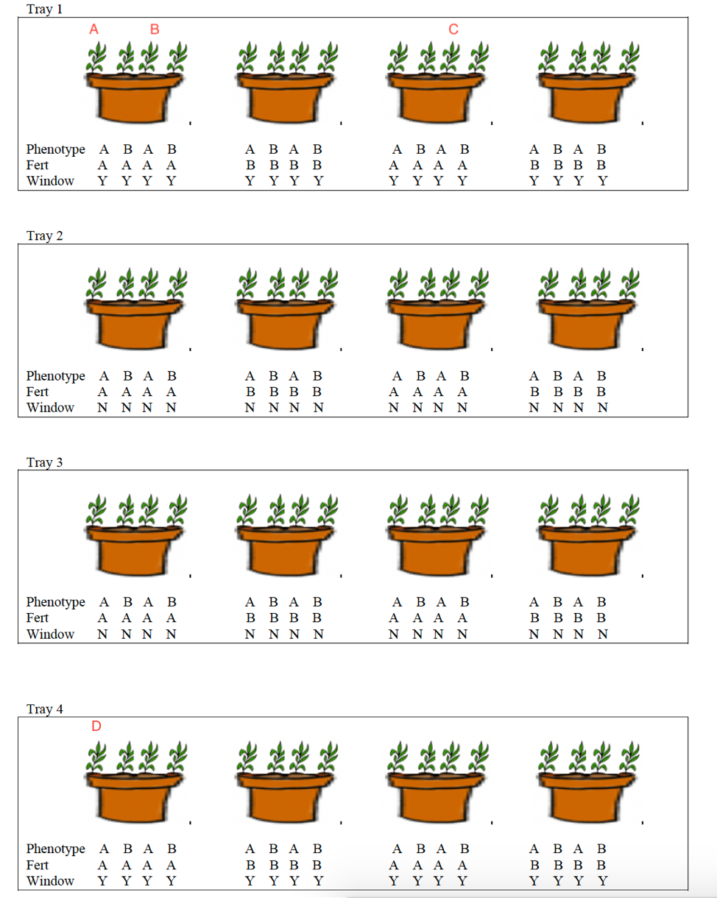

# Data with Three or More Levels


```{r, include=FALSE}
knitr::opts_chunk$set(echo = TRUE, message=FALSE, warning=FALSE, fig.width = 6, fig.height = 3)
```

These notes accompany Chapter 10 in [Beyond Multiple Linear Regression](https://bookdown.org/roback/bookdown-BeyondMLR/) by Roback and Legler. 


```{r}
# Packages required for Chapter 10
library(MASS)
library(gridExtra)  
library(mnormt) 
library(lme4) 
library(lmerTest)
library(knitr) 
library(kableExtra)
library(tidyverse)
library(Hmisc)
library(nlme)
```


## Three-Level Plants Experiment

### Experimental Design

Researchers are interested in comparing heights of plants of two different genotypes (A and B), with two different fertilizers (A and B), and also in assessing whether being close to window affects growth. Scientists obtained four trays and placed four pots in each tray. Two of the trays were placed close to windows and the other two were placed away from windows. Within each tray, two of the pots received fertilizer A and two received fertilizer B. Two plants of each phenotype were then planted in each plot. After 4 weeks, researchers recorded the height of each plant. 

```{r, echo=FALSE, fig.cap="Potted Plant Experimental Design", out.width = '75%'}

```

### The Data

```{r, echo=FALSE}
set.seed(02082021)
plantid <- 1:64
tray <- rep(1:4, each=16)
pot <- rep(1:16, each=4)
window <- c(rep(1,16), rep(0,32), rep(1,16))
fertA <- rep(c(rep(1,4), rep(0,4)),8) 
phenoA <- rep(c(1,0), 32)
trayeffect <- rep(rnorm(4,0,0.22), each=16)
poteffect <- rep(rnorm(16,0,.6), each=4)
height <- 3 + 0.27*phenoA + 0.49*fertA + 0.75*window + rnorm(64, 0, 1) + trayeffect +poteffect 
plants <- data.frame(plantid, tray, pot, window, fertA, phenoA, height)
plants$height <- round(plants$height,2)
```

The first 20 rows of the dataset are shown below. 

```{r}
head(plants, 20)
```

### Questions

1. Between plants B, C, and D, which would you expect to be most highly correlated with plant A? Which would you expect to be least highly correlated with plant A?
2. What are the observational units at each level? What are the treatments or variables?   


### Three Level Model 

Let $Y_{ijk}$ represent the height of plant $k$ in pot $j$ in tray $i$. A possible model is:  

$$
\begin{align*}
Y_{ij} & = [\alpha_{0}+\alpha_{1}\textrm{Window}_{i}+\beta_{0}\textrm{FertA}_{ij}+\gamma_{0}\textrm{PhenoA}_{ijk}] \\
 & \textrm{} + [t_{i}+ p_{ij} + \epsilon_{ijk}],
\end{align*}
$$

where $t_i\sim N(0, \sigma^2_t)$, $p_{ij}\sim N(0, \sigma^2_p)$, and $\epsilon_{ijk}\sim N(0, \sigma^2)$

This model includes fixed effects for window, fertilizer, and phenotype, and random effects for tray and pot. We assume there are no interactions between the fixed effects.    

The model includes 3 random effects:

* $t_i$ - deviations in average plant heights between trays, after accounting for the three fixed effects.   
* $p_{ij}$ - deviations in average plant height between pots in the same tray, after accounting for the three fixed effects. 
* $\epsilon_{ijk}$ - deviations between individual plants in the same tray and pot after accounting for the three fixed effects.   

The model does not include any random slope effects. This means we are assuming the effect of phenotype is the same in each pot, and the effect of fertilizer is the same in each tray.   

### R Implementation of Three Level Model 

```{r}
M <- lmer(data=plants, height ~ window + fertA + phenoA  + (1|pot) + (1|tray))
summary(M)
```

$\hat{\sigma}_p=0.6917$, $\hat{\sigma}_t=0.3655$, $\hat{\sigma}=1.0380$. 

After accounting for phenotype, fertilizer, and window, the greatest amount of remaining variability occurs between individual plants in the same pot, followed by average heights among pots in the same tray, followed by average heights between trays.   


### Inappropriate LLSR Model

We compare this to an inappropriately fit LLSR model. 


```{r}
M_LLSR <- lm(data=plants, height ~ window + fertA + phenoA  )
summary(M_LLSR)
```

* the LLSR model inappropriately assumes we have 64 independent observations    

* Since the phenotype variable pertains to the 64 individual plants, the "effective" sample size for inference about phenotype is still 64. Since we are able to randomly assign phenotypes within pots, the multilevel model accounts for variability associated with pot and tray, taking $\sigma^2_t$ and $\sigma^2_p$ out of the calculation of $\sigma^2$ in the LSSR model, resulting in a smaller standard error associated with phenotype.    

* Since fertilizer was assigned to pots, rather than plants, the "effective" sample size is 16. This smaller sample size leads to higher standard error associated with the effect of fertilizer.   

* Since window was assigned to trays, the "effective" sample size is 4, resulting in the highest standard errors being associated with trays.   

## Three-Level Model with Random Slopes

### Random Slope for PhenoA

We could allow for the possibility that the effect of phenotype is different in different pots, by adding a random slope effect for phenotype.  

$$
\begin{align*}
Y_{ijk} & = [\alpha_{0}+\alpha_{1}\textrm{Window}_{i}+\beta_{0}\textrm{FertA}_{ij}+\gamma_{0}\textrm{PhenoA}_{ijk}] \\
 & \textrm{} + [t_i  + p_{ij} + q_{ij}\textrm{PhenoA}_{ij} + \epsilon_{ijk}],
\end{align*}
$$

where $t_i\sim N(0, \sigma^2_t)$, and $\epsilon_{ijk}\sim N(0, \sigma^2)$

$$
\left[ \begin{array}{c}
            p_{ij} \\q_{ij}
          \end{array}  \right] \sim N \left( \left[
          \begin{array}{c}
            0 \\ 0
          \end{array} \right], \left[
          \begin{array}{cc}
            \sigma_{p}^{2} & \rho_{pq}\sigma_{p}\sigma_q \\
            \rho_{pq}\sigma_{p}\sigma_q & \sigma_{q}^{2}
          \end{array} \right] \right) 
$$

We assume random error terms on different levels are independent of each other. That is, $t_i$ is independent of $p_{ij}$ and $q_{ij}$, and all of these are independent of $\epsilon_{ijk}$. 

### R Output for Random Slope for PhenoA

```{r}
M3 <- lmer(data=plants, height ~ window + fertA + phenoA  + (phenoA|pot) + (1|tray))
summary(M3)
```

The negative estimate of correlation $\rho_{pq}$ indicates that differences between phenotypes are smaller in pots when plants of phenotype B are taller.   


### Random Slope for Fert 

What if we want to allow for the possibility that the effects of fertilizers varies between trays?

The R code for such a model is shown below.

```{r}
M4 <- lmer(data=plants, height ~ window + fertA + phenoA  + (1|pot) + (fertA|tray))
```

How would we write this model mathematically? Include any distributional assumptions about the random effects and error terms.  


### R Output for Random Slope for Fert

```{r}
M4 <- lmer(data=plants, height ~ window + fertA + phenoA + (1|pot) + (fertA|tray))
summary(M4)
```

### Boundary Constraints

Recall that $-1\leq\rho\leq1$, where $\rho$ represents the correlation between random effects at the same level. When $\hat{\rho}=\pm1$, this indicates that the maximimum likelihood estimates are occuring along a boundary of this range, usually making them unreliable. 

In these situations, we should not draw conclusions basde on $\rho$ and should consider dropping this random effect from the model.   


We could also add interaction or nonlinear terms for fixed effects if we had reason to do so. 


## Longitudinal Component to Plants Data

### Repeated Measures over Time

Now suppose that in addition to this first measurement, the heights of the same plants were recorded again once per week for 4 weeks. 


```{r, echo=FALSE}
set.seed(02082021)
plantid <- 1:64
tray <- rep(1:4, each=16)
pot <- rep(1:16, each=4)
window <- c(rep(1,16), rep(0,32), rep(1,16))
fertA <- rep(c(rep(1,4), rep(0,4)),8)
phenoA <- rep(c(1,0), 32)
trayeffect <- rep(rnorm(4,0,0.22), each=16)
poteffect <- rep(rnorm(16,0,.6), each=4)
height1 <- 3 + 0.27*phenoA + 0.49*fertA + 0.75*window + rnorm(64, 0, 1) + trayeffect +poteffect
heightchange1 <- 0.2*(3 + 0.27*phenoA + 0.49*fertA + 0.75*window + rnorm(64, 0, 1) + trayeffect +poteffect)
heightchange2 <- 0.2*(3 + 0.27*phenoA + 0.49*fertA + 0.75*window + rnorm(64, 0, 1) + trayeffect +poteffect)
heightchange3 <- 0.2*(3 + 0.27*phenoA + 0.49*fertA + 0.75*window + rnorm(64, 0, 1) + trayeffect +poteffect)
height2 <- height1+heightchange1
height3 <- height2+heightchange2
height4 <- height3+heightchange3
plants1 <- data.frame(plantid, tray, pot, window, fertA, phenoA, height1)
names(plants1)[7] <- "height"
plants2 <- data.frame(plantid, tray, pot, window, fertA, phenoA, height2)
names(plants2)[7]  <- "height"
plants3 <- data.frame(plantid, tray, pot, window, fertA, phenoA, height3)
names(plants3)[7]  <- "height"
plants4 <- data.frame(plantid, tray, pot, window, fertA, phenoA, height4)
names(plants4)[7]  <- "height"
plants <- rbind(plants1, plants2, plants3, plants4)
plants$time <- rep(1:4, each=64)
plants <- plants %>% select(plantid, time, everything()) %>% arrange(plantid)
```

```{r}
head(plants, 20)
```

### Levels and Variables

Now, this is a 4-level dataset.  

| Level | Observational Unit | Treatment or Variable |
|-------|-------------|---------------------|
| Level 1 | time points | time |   
| Level 2 | plants | phenotype |   
| Level 3 | pots | fertilizer |   
| Level 4 | trays |  window | 


### Model for Longitudinal Plants Study

Let $Y_{ijkl}$ represent the height of plant $k$ in pot $j$ in tray $i$ at time $l$. A possible model is:  

$$
\begin{align*}
Y_{ijkl} & = [\alpha_{0}+\alpha_{1}\textrm{Window}_{i}+\beta_{0}\textrm{FertA}_{ij}+\gamma_{0}\textrm{PhenoA}_{ijk} + \delta_{0}\textrm{Time}_{ijkl}] \\
 & \textrm{} + [t_{i}+ p_{ij} + f_{ijk} + \epsilon_{ijkl}],
\end{align*}
$$

where $t_i\sim N(0, \sigma^2_t)$, $p_{ij}\sim N(0, \sigma^2_p)$, $f_{ijk}\sim N(0, \sigma^2_f)$,and $\epsilon_{ijkl}\sim N(0, \sigma^2)$

This model involves random intercepts for each tray($t_i$), pot($p_{ij}$), plant ($f_{ijk}$), in addition to a random error term $\epsilon{ijkl}$ capturing random differences between measurements on the same plant over time. 

In addition to the assumptions of model 1, it assumes each plant grows at the same rate over time, after accounting for the fixed effects in the model.   


### R Output for Longitudinal Model

```{r}
M5 <- lmer(data=plants, height ~ window + fertA + phenoA + time + (1|tray) + (1|pot) + (1|plantid))
summary(M5)
```

We see that after accounting for time, phenotype, fertilizer, and window location, there is more variability between average heights of different plants in the same pot ($\sigma_f=1.05$), and in average heights in different pots in the same tray ($\sigma_p=0.88$), than between average heights in different trays($\sigma_t=0.27$), or between heights of the same plant at different times($\sigma=0.28$).    

There is evidence that plants grow over time, and evidence of differences between the phenotypes.   


## Four-Level Longitudinal Model with Random Slopes

### Random Slope for Time

We could add a random error term associated with the slope on time, to allow for the possibility that individual plants grow at different rates, even after accounting for the fixed effects in the model 

$$
\begin{align*}
Y_{ijkl} & = [\alpha_{0}+\alpha_{1}\textrm{Window}_{i}+\beta_{0}\textrm{FertA}_{ij}+\gamma_{0}\textrm{PhenoA}_{ijk} + \delta_{0}\textrm{Time}_{ijkl}]  \\
 & \textrm{} + [t_{i}+ p_{ij} + f_{ijk} + g_{ijk}\textrm{Time}_{ijk} + \epsilon_{ijkl}],
\end{align*}
$$

where $t_i\sim N(0, \sigma^2_t)$, $p_{ij}\sim N(0, \sigma^2_p)$, $\epsilon_{ijkl}\sim N(0, \sigma^2)$, and 

$$
\begin{equation*} 
\left[ \begin{array}{c}
            f_{ijk} \\g_{ijk}
          \end{array}  \right] \sim N \left( \left[
          \begin{array}{c}
            0 \\ 0
          \end{array} \right], \left[
          \begin{array}{cc}
            \sigma_{f}^{2} & \rho_{fg}\sigma_{f}\sigma_g \\
            \rho_{fg}\sigma_{f}\sigma_g & \sigma_{g}^{2}
          \end{array} \right] \right) 
\end{equation*}
$$

```{r}
M5 <- lmer(data=plants, height ~ window + fertA + phenoA + time+  (time|plantid) + (1|pot) + (1|tray))
summary(M5)
```

The positive correlation between $s_{ijk}$ and $r_{ijk}$ tells us that taller plants tend to grow faster on average, even after accounting for fixed effects in the model. 


### More Random Slope Terms

We could also allow the effect of phenotype to vary between pots and the effect of fertilizer to vary between trays. This gives a model of the form:


$$
\begin{align*}
Y_{ijk} & = [\beta_{0}+\beta_{1}\textrm{Window}_{i}+\beta_{2}\textrm{FertA}_{ij}+\beta_{3}\textrm{PhenoA}_{ijk} + \beta_{3}\textrm{Time}_{ijkl}] \\
 & \textrm{} + [t_{i}+ s_i\textrm{fertA}_i + p_{ij} + q_{ij}\textrm{phenoA}_{ij} + f_{ijk} + g_{ijk}\textrm{Time}_{ijk} + \epsilon_{ijkl}],
\end{align*}
$$

We again assume that random effects at different levels are independent. Thus, $\epsilon_{ijkl}\sim\mathcal{N}(0, \sigma^2)$


$$
\begin{equation*} 
\left[ \begin{array}{c}
            t_{i} \\s_{i}
          \end{array}  \right] \sim N \left( \left[
          \begin{array}{c}
            0 \\ 0
          \end{array} \right], \left[
          \begin{array}{cc}
            \sigma_{t}^{2} & \rho_{ts}\sigma_{t}\sigma_s \\
            \rho_{ts}\sigma_{t}\sigma_s & \sigma_{s}^{2}
          \end{array} \right] \right) 
\end{equation*}
$$

$$
\begin{equation*} 
\left[ \begin{array}{c}
            p_{ij} \\q_{ij}
          \end{array}  \right] \sim N \left( \left[
          \begin{array}{c}
            0 \\ 0
          \end{array} \right], \left[
          \begin{array}{cc}
            \sigma_{p}^{2} & \rho_{pq}\sigma_{p}\sigma_q \\
            \rho_{pq}\sigma_{p}\sigma_q & \sigma_{q}^{2}
          \end{array} \right] \right) 
\end{equation*}
$$


$$
\begin{equation*} 
\left[ \begin{array}{c}
            f_{ijk} \\g_{ijk}
          \end{array}  \right] \sim N \left( \left[
          \begin{array}{c}
            0 \\ 0
          \end{array} \right], \left[
          \begin{array}{cc}
            \sigma_{f}^{2} & \rho_{fg}\sigma_{f}\sigma_g \\
            \rho_{fg}\sigma_{f}\sigma_g & \sigma_{g}^{2}
          \end{array} \right] \right) 
\end{equation*}
$$

```{r}
M5 <- lmer(data=plants, height ~ window + fertA + phenoA + time+  (time|plantid) + (phenoA|pot) + (fertA|tray))
summary(M5)
```

After accounting for window, fertilizer, phenotype, and time,    

* plants that are taller initially tend to grow faster than those that are shorter initially ($\hat{\rho}_{fg} =0.22$)    
* difference between phenotypes is smaller in pots where plants of phenotype B are taller    

* difference between fertilizers is smaller in trays where plants receiving fertilizer B are taller


### Additional Random Slopes

In theory, we could add a random slope term that also allows plants in the same pot to change at different rates over time.  

We would write this model as:

$$
\begin{align*}
Y_{ij} & = [\beta_{0}+\beta_{1}\textrm{Window}_{i}+\beta_{2}\textrm{FertA}_{ij}+\beta_{3}\textrm{PhenoA}_{ijk} + \beta_{3}\textrm{Time}_{ijkl}] \\
 & \textrm{} + [t_{i}+ s_i\textrm{fertA}_i + p_{ij} + q_{ij}\textrm{phenoA}_{ij} +r_{ij}\textrm{Time}_{ijk}+ f_{ijk} + g_{ijk}\textrm{Time}_{ijk} + \epsilon_{ijkl}],
\end{align*}
$$

We again assume that random effects at different levels are independent. Thus, $\epsilon_{ijkl}\sim\mathcal{N}(0, \sigma^2)$


$$
\begin{equation*} 
\left[ \begin{array}{c}
            t_{i} \\s_{i}
          \end{array}  \right] \sim N \left( \left[
          \begin{array}{c}
            0 \\ 0
          \end{array} \right], \left[
          \begin{array}{cc}
            \sigma_{t}^{2} & \rho_{ts}\sigma_{t}\sigma_s \\
            \rho_{ts}\sigma_{t}\sigma_s & \sigma_{s}^{2}
          \end{array} \right] \right) 
\end{equation*}
$$

$$
\begin{equation*} 
\left[ \begin{array}{c}
            p_{ij} \\q_{ij} \\ r_{ij}
          \end{array}  \right] \sim N \left( \left[
          \begin{array}{c}
            0 \\ 0 \\ 0
          \end{array} \right], \left[
          \begin{array}{cc}
            \sigma_{p}^{2} & \rho_{pq}\sigma_{p}\sigma_q & \rho_{pr}\sigma_{p}\sigma_r\\
            \rho_{pq}\sigma_{p}\sigma_q & \sigma_{q}^{2}& \rho_{qr}\sigma_{q}\sigma_r\\
            \rho_{pr}\sigma_{p}\sigma_r & \rho_{qr}\sigma_{q}\sigma_r & \sigma_r^2 \\
          \end{array} \right] \right) 
\end{equation*}
$$


$$
\begin{equation*} 
\left[ \begin{array}{c}
            f_{ijk} \\g_{ijk}
          \end{array}  \right] \sim N \left( \left[
          \begin{array}{c}
            0 \\ 0
          \end{array} \right], \left[
          \begin{array}{cc}
            \sigma_{f}^{2} & \rho_{fg}\sigma_{f}\sigma_g \\
            \rho_{fg}\sigma_{f}\sigma_g & \sigma_{g}^{2}
          \end{array} \right] \right) 
\end{equation*}
$$

### R - Model with Additional Random Slopes

```{r}
M6 <- lmer(data=plants, height ~ window + fertA + phenoA + time+  (time|plantid) + (time|pot) + (phenoA|pot) + (fertA|tray))
summary(M6)
```

This model, however, leads to boundary contraint issues.   

### When Not to Add Random Slopes

We can only add random slopes for variables measured at a lower level than the observational unit. Otherwise, the variable will not change within the observational unit. 

For example, we can't add a random slope for effect of fertilizer (a level 3 variable) between pots (our level 3 observational units). All plants in the same pot have the same type of fertilizer, so we can't estimate difference of fertilizer effects between pots.   

```{r}
M7 <- lmer(data=plants, height ~ window + fertA + phenoA + time+  (1|plantid) + (1|pot) + (fertA|pot) + (1|tray))
summary(M7)
```

In this section, we have focused on random effects, but we can, of course, explore fixed effects (such as interactions) as we've done before. 
