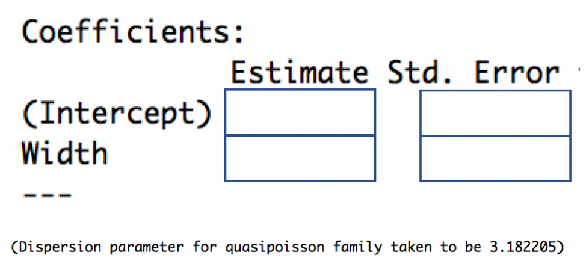

# Poisson Regression

**Chapter 6 Learning Outcomes**     

31. Determine whether it is appropriate to use a Poisson regression model in a given situation and justify your answer.      

32. State the assumptions associated with a Poisson regression model and determine whether the assumptions are satisfied.      

33. Calculate expected responses and expected changes associated with fixed effects in a Poisson regression model.      

34. Use drop-in-deviance and goodness-of-fit tests to assess and compare models.      

35. Interpret fixed effect coefficients in a Poisson regression model.      

36. Explain how to detect and control for overdispersion in a Poisson regression model.      

37. Explain the purpose of using an offset term in Poisson regression.       

38. Compare and contrast properties of LLSR models and Poisson regression models.      

39. Analyze data using a Poisson regression model in R. 


```{r, include=FALSE}
knitr::opts_chunk$set(echo = TRUE, message=FALSE, warning=FALSE, fig.width = 6, fig.height = 3)
```

These notes provide a summary of Chapter 4 in [Beyond Multiple Linear Regression](https://bookdown.org/roback/bookdown-BeyondMLR/) by Roback and Legler. Much of the code that appears here comes from the textbook's [Github repository](https://github.com/proback/BeyondMLR/). 


```{r load_packages4, message = FALSE, echo=FALSE}
# Packages required for Chapter 4
library(gridExtra)
library(knitr)
library(kableExtra)
library(mosaic)
library(xtable)
library(pscl) 
library(multcomp)
library(pander)
library(MASS)
library(tidyverse)
```

```{r include=FALSE}
if(knitr::is_html_output()){options(knitr.table.format = "html")} else {options(knitr.table.format = "latex")}
```


## Modeling Counts

### Case Study: Household Size in the Philippines  

From Roback & Legler's text: 

*How many other people live with you in your home? The number of people sharing a house differs from country to country and often from region to region. International agencies use household size when determining needs of populations, and the household sizes determine the magnitude of the household needs.*

*The Philippine Statistics Authority (PSA) spearheads the Family Income and Expenditure Survey (FIES) nationwide. The survey, which is undertaken every three years, is aimed at providing data on family income and expenditure, including levels of consumption by item of expenditure. Our data, from the 2015 FIES, is a subset of 1500 of the 40,000 observations.  Our data set focuses on five regions: Central Luzon, Metro Manila, Ilocos, Davao, and Visayas.* 

### Map of the Philippines

```{r, philippinesmap, out.width='50%', fig.show='hold', fig.cap="Regions of the Philippines.", fig.align = 'center', echo=FALSE}
knitr::include_graphics("map_of_philippines.jpeg")
```

### Questions of Interest 

* Does household size vary between regions of the country?   

* At what age are heads of households in the Philippines most likely to find the largest number of people in their household?     

* Is this association similar for poorer households (measured by the presence of a roof made from predominantly light/salvaged materials)? 

### The Data

```{r}
fHH1 <- read_csv("https://raw.githubusercontent.com/proback/BeyondMLR/master/data/fHH1.csv")
```

The data include the following variables:   

- `location` = where the house is located (Central Luzon, Davao Region, Ilocos Region, Metro Manila, or Visayas)
- `age` = the age of the head of household
- `total` = the number of people in the household other than the head
- `numLT5` = the number in the household under 5 years of age 
- `roof` = the type of roof in the household (either Predominantly Light/Salvaged Material, or Predominantly Strong Material, where stronger material can sometimes be used as a proxy for greater wealth)

### First 5 Rows

```{r, fHH1table1, comment=NA}
head(fHH1)
```


### Household Size by Region

```{r}
fHH1  %>% group_by(location)  %>% 
  summarise(mean=mean(total), sd=sd(total), 
            var=var(total), n=n())
```


### Household Size by Region Plots

```{r, nhouse, fig.align="center",out.width="60%", warning=FALSE, message=FALSE}
ggplot(fHH1, aes(total)) + 
  geom_histogram(binwidth = .25, color = "black", 
                 fill = "white") + facet_wrap(~location) + 
  xlab("Number in the house excluding head of household") +
  ylab("Count of households")
```

* responses range from 0 to 16 and are most often between 1 and 5     
* number of people in a house is right skewed and cannot be be negative     

### Modeling Household Size

Let $Y_i$ represent the size of household $i$. We'll use location as an explanatory variable.    

In this example, we'll treat location as a fixed effect, since we're interested in comparing and drawing conclusions about the five regions.  

### Inappropriate LLSR Model

On first thought, we might consider an ordinary LLSR model of the form 

\[
Y_i = \beta_0 + \beta_1\textrm{locationDavao}_i + \beta_2\textrm{locationIlocos}_i + \\\beta_3\textrm{locationMetroManila}_i + \beta_4\textrm{locationVisayas}_i + \epsilon_i
\]

where $\epsilon_i\sim\mathcal{N}(0,\sigma^2)$

### LLSR Model R Output

```{r}
M1 <- lm(data=fHH1, total ~ location)
summary(M1)
```

### LLSR Assumptions    

The LLSR model assumes that in region $j$, household sizes are:   

1. Independent    
2. Normally distributed with mean $\beta_0 + \beta_j$ and variance $\sigma^2$ 
3. Variance $\sigma^2$ is constant between regions    

The linearity assumption is not relevant here since the explanatory variable is categorical.   


### Distribution in Visayas Region

According to the model, household sizes in the Visayas region are normally distributed with mean $\hat{\beta}_0 + \hat{\beta}_4 = 3.9$ and standard deviation $\hat{\sigma} = 2.346$. 

```{r}
ggplot(fHH1 %>% filter(location=="Visayas"), aes(total)) + 
geom_histogram(aes(y = ..density..), binwidth = 0.25, colour = "black") + 
stat_function(fun = dnorm, args = list(mean = 3.9, sd = 2.346), size=1, color="red") + 
  xlab("Number in the house excluding head of household") +
  ylab("Count of households") + xlim(c(-5,20))
```

**Problems**

The normal distribution:   

* allows for negative household sizes    
* allows for non-integer household sizes      
* underestimates probability of household sizes above 10 (fails to accunt for right-skewness)    
 
### Normal Quantile Quantile Plot 
 
A normal quantile-quantile plot graphs the quantiles of the model residuals against the expected quantiles from a normal distribution. If the normal distribution is appropriate, the points should lie close to a diagonal line.  

```{r}
ggplot(data=data.frame(M1$residuals), aes(sample = scale(M1$residuals))) + stat_qq() + stat_qq_line() + xlab("Normal Quantiles") + ylab("Residual Quantiles") + ggtitle("QQ Plot")
```

Residual quantiles are higher than expected on the left (since there are no negative household sizes), and on the right (since some households are larger than expected). 

The normal distribution is a poor fit.   

## Poisson Regression Models

### The Poisson Distribution

A **Poisson** random variable is a discrete random variable that takes on nonnegative integers. It depends on parameter $\lambda >0$,representing the mean. 

Poisson random variables are useful when modeling counts. 
 
**Notation**: $Y\sim Pois(\lambda)$,    <b style="word-space:2m">&nbsp;&nbsp;</b> 
**Probability Mass Function**: $\text{P}(Y=y) = e^{-\lambda}\lambda^y/y!$ <b style="word-space:2m">&nbsp;&nbsp;</b>

For $\lambda=1$, 

\[ Pr(Y=0) = e^{-1}1^0/0! = e^{-1}\approx(0.3679)
\]

\[ Pr(Y=1) = e^{-1}1^1/1! = e^{-1}\approx(0.3679)
\]

\[ Pr(Y=2) = e^{-1}1^2/2! = e^{-1}/2\approx(0.1839)
\]

\[ Pr(Y=3) = e^{-1}1^3/3! = e^{-1}/6\approx(0.0613)
\]


### Poisson Distribution for $\lambda=1$

```{r, fig.height=3, fig.width=6}
df <- data.frame(x = 0:10, y = dpois(0:10, 1))
ggplot(df, aes(x = x, y = y)) + geom_bar(stat = "identity", col = "white", fill = "blue") + 
  scale_y_continuous(expand = c(0.01, 0)) + scale_x_continuous(breaks=(0:10)) + xlab("x") + ylab(expression(paste("p(x|", theta, ")"))) + ggtitle(expression(paste(lambda, "=1"))) + theme_bw() + 
  theme(plot.title = element_text(size = rel(1.2), vjust = 1.5))
```

Mean = 1    

Variance = 1


### Poisson Distribution for $\lambda\in\{1,3,5\}$

```{r, echo=FALSE, fig.height=3, fig.width=10}
df <- data.frame(x = 0:10, y = dpois(0:10, 1))
p1 <- ggplot(df, aes(x = x, y = y)) + geom_bar(stat = "identity", col = "white", fill = "blue") + 
  scale_y_continuous(expand = c(0.01, 0)) + scale_x_continuous(breaks=(0:10)) + xlab("x") + ylab(expression(paste("p(x|", theta, ")"))) + ggtitle(expression(paste(lambda, "=1"))) + theme_bw() + 
  theme(plot.title = element_text(size = rel(1.2), vjust = 1.5))

df <- data.frame(x = 0:10, y = dpois(0:10, 3))
p2 <- ggplot(df, aes(x = x, y = y)) + geom_bar(stat = "identity", col = "white", fill = "blue") + 
  scale_y_continuous(expand = c(0.01, 0))+ scale_x_continuous(breaks=(0:10)) + xlab("x") + ylab(expression(paste("p(x|", theta, ")"))) + ggtitle(expression(paste(lambda, "=3"))) + theme_bw() + 
  theme(plot.title = element_text(size = rel(1.2), vjust = 1.5))

df <- data.frame(x = 0:20, y = dpois(0:20, 5))
p3 <- ggplot(df, aes(x = x, y = y)) + geom_bar(stat = "identity", col = "white", fill = "blue") + 
  scale_y_continuous(expand = c(0.01, 0))+ scale_x_continuous(breaks=(0:20)) + xlab("x") + ylab(expression(paste("p(x|", theta, ")"))) + ggtitle(expression(paste(lambda, "=5"))) + theme_bw() + 
  theme(plot.title = element_text(size = rel(1.2), vjust = 1.5))

grid.arrange(p1, p2, p3, ncol=3)
```

Poisson distributions are right-skewed, especially when $\lambda$ is small. 

In a Poisson distribution, the mean is equivalent to its variance (both are equal to $\lambda$).   


### Connecting Expected Response to Explatory Variables     

In a LLSR model, for a given set of values/categories for explanatory variables $X_1, \ldots, X_p$, the response variable is normally distributed with mean:

\[E(Y) = \mu =  \beta_0+\beta_1X_{1} + \ldots + \beta_pX_p\]

In a Poisson regression model, we don't want to assume

\[E(Y) = \lambda =  \beta_0+\beta_1X_{1} + \ldots + \beta_pX_p\]

because this would allow $\lambda$ to be negative.     

Instead, we assume 

\[E(Y) = \lambda = e^{\beta_0+\beta_1X_{1} + \ldots + \beta_pX_p},\] ensuring $\lambda>0$. 

Equivalently, we assume

\[ \text{log}(E(Y)) = \text{log}(\lambda) = \beta_0+\beta_1X_{1} + \ldots + \beta_pX_p\]. 

The function that relates the expected response to the linear function of the explanatory variables is called a **link function.** In Poission regression, the link function is $f(y)= log(y).$

Note: we could use other nonnegative functions to link the expected response to the explanatory variables, but the log function works especially well here, and is the one most frequently used.   


To summarize:
* a LLSR model assumes the expected response is a linear function of the explanatory variables.   
* a Poisson regression model assumes the log of the expected response is a linear function of the explanatory variables.   


### Poisson Regression Assumptions

In a Poisson regression model, we assume:   

1. __Poisson Response__ The response variable is a count per unit of time or space, described by a Poisson distribution.     
2. __Independence__ The observations must be independent of one another, after accounting for fixed effects.     
3. __Mean=Variance__ For given value(s) or category(ies) of the explanatory variable(s), the response variable must follow a distribution whose mean is equal to its variance.           
4. __Linearity__ For numeric explanatory variable(s) x, the log of the mean rate, log($\lambda$), must be a linear function of x.     

### Poisson Regression Illustration


```{r, OLSpois, fig.align="center",out.width="60%", fig.cap='Regression models: Linear regression (left) and Poisson regression (right).',echo=FALSE, warning=FALSE, message=FALSE, fig.width=10, fig.height=4}
## Sample data for graph of OLS normality assumption
## Code from https://stackoverflow.com/questions/31794876/ggplot2-how-to-curve-small-gaussian-densities-on-a-regression-line?rq=1
set.seed(0)
dat <- data.frame(x=(x=runif(10000, 0, 50)),
                  y=rnorm(10000, 10*x, 100))
## breaks: where you want to compute densities
breaks <- seq(0, max(dat$x), len=5)
dat$section <- cut(dat$x, breaks)
## Get the residuals
dat$res <- residuals(lm(y ~ x, data=dat))
## Compute densities for each section, flip the axes, add means 
## of sections.  Note: densities need to be scaled in relation 
## to section size (2000 here)
dens <- do.call(rbind, lapply(split(dat, dat$section), function(x) {
  d <- density(x$res, n=5000)
  res <- data.frame(x=max(x$x)- d$y*1000, y=d$x+mean(x$y))
  res <- res[order(res$y), ]
  ## Get some data for normal lines as well
  xs <- seq(min(x$res), max(x$res), len=5000)
  res <- rbind(res, data.frame(y=xs + mean(x$y),
                x=max(x$x) - 1000*dnorm(xs, 0, sd(x$res))))
  res$type <- rep(c("empirical", "normal"), each=5000)
  res
}))
dens$section <- rep(levels(dat$section), each=10000)
ols_assume <- ggplot(dat, aes(x, y)) +
  geom_point(size = 0.1, alpha = .25) +
  geom_smooth(method="lm", fill=NA, lwd=2) +
  geom_path(data=dens[dens$type=="normal",], 
            aes(x, y, group=section), 
            color="salmon", lwd=1.1) +
  theme_bw() +
  geom_vline(xintercept=breaks, lty=2) + ggtitle("Linear Least Squares Regression")
# Now make Poisson regression picture
set.seed(0)
dat <- data.frame(x=(x=runif(1000, 0, 20)),
                  y=rpois(1000, exp(.1*x)))
## breaks: where you want to compute densities
breaks <- seq(2, max(dat$x), len=5)
dat$section <- cut(dat$x, breaks)
## Get the residuals
dat$res <- dat$y - .1*dat$x
## Compute densities for each section, flip the axes, add means
## of sections.  Note: densities need to be scaled in relation 
## to section size
dens <- do.call(rbind, lapply(split(dat, dat$section), function(x) {
  d <- density(x$res, n=500)
  res <- data.frame(x=max(x$x)- d$y*10, y=d$x+mean(x$y))
  res <- res[order(res$y), ]
  ## Get some data for poisson lines as well
  xs <- seq(min(x$y), max(x$y), len=500)
  res <- rbind(res, data.frame(y=xs,
          x=max(x$x) - 10*dpois(round(xs), exp(.1*max(x$x)))))
  res$type <- rep(c("empirical", "poisson"), each=500)
  res
}))
dens$section <- rep(levels(dat$section), each=1000)
pois_assume <- ggplot(dat, aes(x, jitter(y, .25))) +
  geom_point(size = 0.1) +
  geom_smooth(method="loess", fill=NA, lwd=2) +
  geom_path(data=dens[dens$type=="poisson",], 
            aes(x, y, group=section), 
            color="salmon", lwd=1.1) +
  theme_bw() + ylab("y") + xlab("x") +
  geom_vline(xintercept=breaks, lty=2) + ggtitle("Poisson Regression")
grid.arrange(ols_assume, pois_assume, ncol = 2)
```

## Poisson Model for Household Size

### Poisson Regression Model for Location

```{r, comment = NA}
MP1 = glm(total ~ location, family = poisson, data = fHH1)
summary(MP1)
```

### Interpreting Model Parameters in Poisson Regression

Given location, the expected household size is given by

\[
log(E(Y)) = log(\lambda) = \beta_0 + \beta_1\textrm{locationDavao}_i + \beta_2\textrm{locationIlocos}_i + \\ \beta_3\textrm{locationMetroManila}_i + \beta_4\textrm{locationVisayas}_i 
\]

In region CentralLuzon (CL) (the intercept):  $log(E(Y)) = log(\lambda_{CL}) = \beta_0$ 

In region Visayas (the intercept):  $log(E(Y)) = log(\lambda_{V}) = \beta_0 + \beta_4$ 


$$
\begin{equation}
\begin{split}
log(\lambda_{CL}) &= \beta_0  \\
log(\lambda_{V}) &= \beta_0 + \beta_4 \\
log(\lambda_{V})-log(\lambda_{CL}) &=  \beta_4 \\
log \left(\frac{\lambda_{V}}{\lambda_{CL}}\right)   &= \beta_4\\
\frac{\lambda_{V}}{\lambda_{CL}} &= e^{\beta_4}
\end{split}
\end{equation}
$$

The expected household size in region Visayas is $e^{\beta_4}$ times as great as in region CentralLuzon.   

We estimate that on average, households in the Visayas region have $e^{0.13714}=1.1469$ times as many (or 14.7% more) people as households in the Central Luzon. region, excluding head of household.   

The small p-value provides strong evidence of differences in  household size between the two regions.  

### Wald-Based Confidence Intervals for Difference

In Poisson regression, assuming sample size is large enough, regression coefficients follow normal distributions, so we can calculate confidence intervals for $\beta_j$ using the formula $\hat\beta_j-Z^*\cdot SE(\hat\beta_j)$.

Tests and intervals based on these estimates are called **Wald-Based**.  

A 95\% CI provides a range of plausible values for $\beta_4$ and can be constructed:

\[(\hat\beta_4-Z^*\cdot SE(\hat\beta_4), \quad \hat\beta_4+Z^*\cdot SE(\hat\beta_4))\]
\[(0.13714-1.96*0.04170, \quad 0.13714+1.96*0.04170)\]
\[ (0.0554, 0.2189).
 \]

We are 95% confident that on average, households in the Visayas region have between $e^{0.0554}=1.056$ and $e^{0.2189}=1.24$ times as many people as households in the Central Luzon region, excluding head of household. Equivalently, households in Visayas are expected to have between 5.6% and 24% more people, on average, than those in Central Luzon.  

```{r, message=FALSE}
# CI for betas using profile likelihood
confint(MP1)
exp(confint(MP1))
```


### Mean = Variance Assumption

Recall the Poisson regression model requires the assumption that $\text{Mean} = \text{Variance} = \lambda$.   

We can check whether this is reasonable by examining the mean and variance of household sizes in each region. 

```{r}
fHH1  %>% group_by(location)  %>% 
  summarise(mean=mean(total), sd=sd(total), 
            var=var(total), n=n())
```

We see that variances are slightly large than the mean, but not considerably larger, so this assumption might be reasonable. 

We'll soon look at what to do when the mean = variance assumption is clearly violated.  

## Poisson Model with Multiple Explanatory Variables     

### Accounting for Age of Head of Household

We add age of the head of household as an explanatory variable in the model. 

\[
log(E(Y)) = log(\lambda) = \beta_0 + \beta_1\text{Age}_i + \beta_2\textrm{locationDavao}_i + \\ \beta_3\textrm{locationIlocos}_i + \beta_4\textrm{locationMetroManila}_i + \beta_5\textrm{locationVisayas}_i
\]

### R Output for Model with Age

```{r, comment = NA}
MP2 = glm(total ~ age + location, family = poisson, data = fHH1)
summary(MP2)
```

### Interpreting Coefficients for Numeric Explanatory Variable

Consider two heads of household in CL where the first person has age $a$, and the second has age $a+1$. Assume both live in Central Luzon, although region doesn't matter as long as it's the same. 

In region Central Luzon (CL):  $log(E(Y)) = log(\lambda_{CL}) = \beta_0 + \beta_1\text{Age}$.  

Age $a$:  $log(E(Y)) = log(\lambda_{a}) = \beta_0 + \beta_1a$ 

Age $a+1$:  $log(E(Y)) = log(\lambda_{a+1}) = \beta_0 + \beta_1(a+1)$ 


$$
\begin{equation}
\begin{split}
log(\lambda_{a+1})-log(\lambda_a) &=  \beta_1 \\
log \left(\frac{\lambda_{a+1}}{\lambda_a}\right)   &= \beta_1\\
\frac{\lambda_{a+1}}{\lambda_a} &= e^{\beta_1}
\end{split}
\end{equation}
$$

For each one-year increase in age of head of household, houshold size is expected to multipy by a factor of $e^{\beta_1}$, assuming region is held constant.  

* Assuming we're comparing households in the same region, for each one-year increase in age of head of household, average household size is expected to multiply be a factor of $e^{-0.004598} = 0.9954$.   

* Assuming we're comparing households in the same region, for each y-year increase in age of head of household, average household size is expected to multiply be a factor of $e^{-0.004598y}$.     
    - For example expected household size for a 50 year old head of house is expected to be $e^{-.004598*10}=0.9551$ times that of a 40 year old head of house (an estimated 4.5% decrease), assuming region is held constant.     
    
    
### Mean = Variance Assumption      

This model depends on the assumption that for a given region and age, mean is equal to variance. 

We'll examine whether this is reasonable, using the largest region, Visayas.    

Since we have limited obsevations for specific ages, we'll group people in similar age ranges together. 

```{r, totalPoisByAge, fig.align="center", out.width="60%", fig.cap= 'Distribution of household sizes by age group of the household head.',  warning = FALSE}
fHH1V <- fHH1 %>% filter(location=="Visayas")
cuts = cut(fHH1V$age,
           breaks=c(15,20,25,30,35,40,45,50,55,60,65,70))
ageGrps <- data.frame(cuts,fHH1V)
ggplot(data = ageGrps, aes(x = total)) +
  geom_histogram(binwidth = .25, color = "black", 
                 fill = "white") +
  facet_wrap(cuts) +
  xlab("Household size")
```

```{r, table1chp4, message = FALSE}
# Mean = Variance
table1chp4<- ageGrps  %>% group_by(cuts)  %>% 
  summarise(mnNum= mean(total),varNum=var(total),n=n())
kable(table1chp4, booktabs=T, 
      caption="Compare mean and variance of household size within each age group.",
      col.names = c("Age Groups", "Mean", "Variance", "n")) %>%
  kable_styling(full_width = F)
```

There is some concern about the validity of the assumption, as variance appears to increase as age increases. 

We'll talk soon about ways to address, this but for now, since the violations are not too severe, we'll proceed with the current model.  

## Deviance and Model Comparison

### Accounting for Nonlinear Trend

Recall that the Poisson regression model assumes that the log of the expected  household counts is a linear function of region and head of household's age.  

\[
log(E(Y)) = log(\lambda) = \beta_0 + \beta_1\text{Age}_i + \beta_2\textrm{locationDavao}_i + \\ \beta_3\textrm{locationIlocos}_i + \beta_4\textrm{locationMetroManila}_i + \beta_5\textrm{locationVisayas}_i
\]

We plot the relationship between log(count) and age for each region. 

```{r, ageXnhouse,fig.align="center",out.width="60%",  warning = FALSE, message = FALSE}
## Checking linearity assumption: Empirical log of the means plot
sumStats <- fHH1 %>% group_by(age, location) %>% 
  summarise(mntotal = mean(total),
            logmntotal = log(mntotal), n=n())
ggplot(sumStats, aes(x=age, y=logmntotal)) +
  geom_point()+
  geom_smooth(method = "loess", size = 1.5)+
  facet_wrap(~location) + 
  xlab("Age of head of the household") +
  ylab("Log of the mean number in the house") 
```

The relationship appears to be quadratic, rather than linear. We should add a quadratic term to our model.  

The effect of age on log(count) appears to be roughly the same in each region. If it weren't, we would need to add interaction terms to the model.   

### Quadratic Poisson Regresson Model

```{r, comment = NA}
fHH1 <- fHH1 %>% mutate(age2 = age*age)
```

```{r}
MP3 <- glm(total ~ age + age2 + location, family = poisson, data = fHH1)
summary(MP3)
```


We can assess the importance of the quadratic term in two ways. First, the p-value for the Wald-type statistic for age$^2$ is statistically significant (Z = -11.058, p < 0.001). Another approach is to perform a drop-in-deviance test.


### Residuals for Poisson Models 

Residuals measure how far observations lie from their expectation, under the model. 


The residuals for linear least squares regression have the form:

$$
\begin{align*}
 \textrm{LLSR residual}_i  &= \textrm{obs}_i - \textrm{fit}_i \nonumber \\
&={Y_i-\hat{\mu}_i} \nonumber \\
 &= Y_i-(\hat{\beta}_0 +\hat{\beta}_1 X_i)
 \end{align*}
$$ 

This calculation wouldn't make sense in Poisson regression because it's $log(E(Y))$, rather than $E(Y)$ that is a linear function of the explanatory variables. 

Instead, we use the following quantity, called deviance residual, to quantify the closeness of an observed value to its expectation under the model:

\[
\textrm{deviance residual}_i = \textrm{sign}(Y_i-\hat{\lambda}_i)
\sqrt{
2 \left[Y_i log\left(\frac{Y_i}{\hat{\lambda}_i}\right)
-(Y_i - \hat{\lambda}_i) \right]}
\]
where $\textrm{sign}(x)$ is defined such that:

\[ \textrm{sign}(x) = \begin{cases} 1  & \textrm{if }\ x > 0 \\
                                    -1 & \textrm{if }\ x < 0  \\
                                    0  & \textrm{if }\ x = 0\end{cases}\]

When $Y_i$ is close to $\hat{\lambda}_i$, then $\left(\frac{Y_i}{\hat{\lambda}_i}\right)$ is close to 1 and $log\left(\frac{Y_i}{\hat{\lambda}_i}\right)$ is close to 0. Likewise $(Y_i - \hat{\lambda}_i)$ is close to 0. Thus, the deviance residual is small.  

As $Y_i$ gets farther from $\hat{\lambda}_i$, the deviance residual increases.   

### Plot of Deviance Residuals for First-Order Poisson Model

```{r,  fig.align="center",out.width="60%",  message=FALSE}
# Residual plot for the first order model
## Log scale
Pred = predict(MP2) # log scale
Resid = resid(MP2)  # linear model
Residdf = data.frame(Pred,Resid)
ggplot(Residdf,aes(x=Pred, y=Resid)) +
  geom_point(alpha = .25)+
  geom_smooth(method = "loess", size = 1.5, linetype = 2)+
  geom_line(y=0, size=1.5, col="red")+
  xlab("Fitted values") +
  ylab("Deviance Residuals") 
```

A plot of the deviance residuals versus predicted responses for the first order model exhibits curvature, supporting the idea that the model may improved by adding a quadratic term. 


### Plot of Deviance Residuals for Quadratic Poisson Model

```{r,  fig.align="center",out.width="60%", message=FALSE}
# Residual plot for the first order model
## Log scale
Pred = predict(MP3) # log scale
Resid = resid(MP3)  # linear model
Residdf = data.frame(Pred,Resid)
ggplot(Residdf,aes(x=Pred, y=Resid)) +
  geom_point(alpha = .25)+
  geom_smooth(method = "loess", size = 1.5, linetype = 2)+
  geom_line(y=0, size=1.5, col="red")+
  xlab("Fitted values") +
  ylab("Deviance Residuals") 
```

The quadratic trend disappears when using the quadratic model, suggesting the model is better capturing the trend in the data.  

### Residual Deviance for a Model

A model's residual deviance is the sum of the squares of the deviance residuals.

__residual deviance__ $=\sum (\textrm{deviance residual})^2_i$.

We can use residual deviance to compare models in a manner similar to the ANOVA lack of fit tests we use in LLSR.   

### Drop-in-Deviance Test

Assume that reduced is nested in larger model. That is, every term in the reduced model is also in the larger model.  

A drop-in-deviance test can be used to test the hypotheses:

Null Hypothesis: Reduced model sufficienty explains variability in $Y$.   

Alternative Hypothesis: Larger model better explains variability in $Y$.   

We can calculate a test statistic by taking the difference in residual deviances between the two models, divided by the difference in the number of parameters. 

\[
W=\frac{\text{Drop in Deviance}}{\text{Difference in # Parameters}}
\]

When the null hypothesis is true, W follows a $\chi^2$ distribution with degrees of freedom equal to the difference in number of parameters between the two models. 

We can compare the observed drop in deviance to the $\chi^2$ distribution to calculate a p-value. 


### Drop-in-Deviance Test

```{r comment=NA, message=FALSE}
anova(MP2, MP3, test = "Chisq")
```


$H_0$: log($\lambda$)=$Y_i = \beta_0 + \beta_1\text{Age} +  \beta_2\textrm{locationDavao}_i + \\ \beta_3\textrm{locationIlocos}_i + \beta_4\textrm{locationMetroManila}_i + \beta_5\textrm{locationVisayas}_i$ (reduced model)

$H_A:$ log($\lambda$)=$Y_i = \beta_0 + \beta_1\text{Age} + \text{Age}^2 +  \beta_2\textrm{locationDavao}_i + \\ \beta_3\textrm{locationIlocos}_i + \beta_4\textrm{locationMetroManila}_i + \beta_5\textrm{locationVisayas}_i$ (larger model)

* The first order model has a residual deviance of 2320.8 with 1494 df    
* The quadratic model has a residual deviance of 2187.8 with 1493 df.    
* If the null hypothesis is correct, the drop in deviance would follow a $\chi^2$ distribution with 1 degree of freedom. The probability of observing a value as extreme as 133.04 on such a distribution is  essentially 0, so the data provide significant support for including the quadratic term.  

### Visual of $\chi^2$ Test

```{r, fig.height=3, fig.width=6}
gf_dist("chisq", df = 1, geom = "area", fill="turquoise") + 
  geom_vline(xintercept=133.04, colour="red")  + theme(legend.position="none") + ylim(c(0,0.1))
```

If the null hypothesis is correct, the drop in deviance would follow a $\chi^2$ distribution with 1 degree of freedom. The probability of observing a value as extreme as 133.04 on such a distribution is  essentially 0, so the data provide significant support for including the quadratic term.

### Adding Roofing Material to Model

We also consider whether there is evidence of differences in household size between the two roofing material types, which might be used to measure household wealth. 

```{r, 4morephil,}
MP4 <- glm(total ~ age + age2 + location + roof, 
              family = poisson, data = fHH1)
summary(MP4)
```

```{r comment=NA, message=FALSE}
anova(MP3, MP4, test = "Chisq")
```

The drop in deviance is small when adding roof type to the model, and the large p-value does not provide evidence that roof type is associated with household size.   

### Visual of $\chi^2$ Test for Roof

```{r, fig.height=3, fig.width=6}
gf_dist("chisq", df = 1, geom = "area", fill = ~ !(x > 1.2)) + 
  geom_vline(xintercept=1.2, colour="red")  + theme(legend.position="none") + ylim(c(0,1))
```

### Goodness-of-Fit 

We can also use a model's residual deviance to test whether it adequtely fits the data. 

Null Hypothesis: The model adequately fits the data    
Alternative Hypothesis: The model does not adequately fit the data    

When the null hypothesis is true, the model's residual deviance follows a $\chi^2$ distribution with $n-p$ degrees of freedom, where $p$ is number of parameters in the model.  

```{r}
MP3$deviance
```

```{r}
MP3$df.residual
```

```{r, comment=NA}
1-pchisq(MP3$deviance, MP3$df.residual) 
```

```{r, fig.height=3, fig.width=6}
gf_dist("chisq", df = 1493, geom = "area", fill = "turquoise") + 
  geom_vline(xintercept=2187.8, colour="red")  + theme(legend.position="none") + ylim(c(0,0.01))
```


The small p-value indicates that the quadratic model does not adequately fit the data. 

We've already counted for the quadratic trend, and determined that roof material does not help explain variability in household size. 

It appears that the deficiency is not with the structure of the model's estimated response, but rather with it's ability to account for variability. 

Recall that variance appeared to increase with age, a violation of the Mean=Variance assumption.   

## Overdisperson

### Quasi-Poisson Model

**Overdispersion** occurs when there is more variability in the distribution of a response variable than a Poisson model would expect, given the value(s) and category(ies) of explanatory variable(s). Recall that the Poisson model assumes Mean=Variance.   

When data are overdispersed, a Poisson regression model will underestimate standard errors, producing confidence intervals that are too narrow, and p-values that are too small. 

We can estimate a dispersion parameter, 
\[
\hat{\phi}=\frac{\displaystyle\sum\left(\frac{Y_i-\hat{\lambda}_i}{\sqrt{\hat{\lambda_i}}}\right)^2}{n-p} 
\]
where $p$ is the number of model parameters. 

We inflate the standard errors by multiplying the variance by $\hat{\phi}$ i.e., $SE_Q(\hat\beta)=\sqrt{\hat\phi}*SE(\hat\beta)$, where $Q$ stands for "quasi-Poisson" \index{quasi-Poisson} 

If there is no overdispersion, this estimate should be close to one. It will be larger than one in the presence of overdispersion.

### Quasi-Poisson Model in R

```{r, echo=FALSE}
options(scipen=999)
```

```{r, comment = NA}
MQP <- glm(total ~ age + age2 + location, family = quasipoisson, data = fHH1)
summary(MQP)
```

### Standard Errors in Quasi-Poisson Model

The dispersion parameter estimate is $\hat{\phi} = 1.414965$.

Example standard error calculation: 
$SE_Q(\hat\beta_6)=\sqrt{1.414965}\times0.0417496 = 0.04966211$

Confidence intervals will be $\sqrt{1.414965}$ times as wide. 

```{r}
confint(MP3)
```


```{r}
confint(MQP)
```


### Drop-in-Deviance Tests for Quasi-Poisson Model

When using a Quasi-Poisson Model the test statistic in a drop in deviance test is

\[
F=\frac{\frac{\text{Drop in Deviance}}{\text{Difference in # Parameters}}}{\hat{\phi}}
\]

When the null hypothesis is true, this statistic follows an F-distribution with degrees of freedom equal to the difference in the number of parameters, and $n-p$ respectively. 

### First vs Second Order Quasi-Poisson Models

We compare first and second order quasi-Poisson models, using a drop-in-deviance test. 

```{r}
MQP1 <- glm(total ~ age + location, family = quasipoisson, data = fHH1)
```

```{r}
anova(MQP1, MQP, test = "F")
```


After adjusting for overdispersion, we still have statistically significant evidence that the quadratic model is preferred.  


## Offsets in Poisson Regression

### Case Study: Campus Crime

We examine data on the number of crimes reported in a year on college campuses. Each row of `c_data.csv` contains crime information from a post secondary institution, either a college or university. The variables include:

- `Enrollment` = enrollment at the school
- `type` =  college (C) or university (U)
- `nv` = the number of violent crimes for that institution for the given year
- `nvrate` = number of violent crimes per 1000 students
- `enroll1000` = enrollment at the school, in thousands
- `region` = region of the country (C = Central, MW = Midwest, NE = Northeast, SE = Southeast, SW = Southwest, and W = West)

```{r}
#Getting started-Crime
# Crime data for Universities and Colleges
c.data <- read_csv("https://raw.githubusercontent.com/proback/BeyondMLR/master/data/c_data.csv")
head(c.data, n=10)
```

### Distribution of Number of Crimes

```{r, nviolent, fig.align="center",out.width="60%", fig.cap='Histogram of number of violent crimes by institution.',echo=FALSE, warning=FALSE, message=FALSE}
ggplot(c.data, aes(x=nv)) + 
  geom_histogram(bins = 15, color = "black", fill = "white") +
  xlab("Number of violent crimes")
```

Since crimes are nonnegative counts, a Poisson model seems reasonable. 


### Crimes by Type of Institution and Region
```{r, regions, echo=FALSE}
table2chp4 <- with(c.data,round(prop.table(table(type,region),2),3)) 
kable(table2chp4, booktabs=T, caption = 'Proportion of colleges and universities within region in the campus crime data set.')
```


* Counts are not directly comparable because they come from different size schools. Instead, we'll display crimes per 1000 students.  


```{r, table4ch4, echo=FALSE, message=FALSE}
# Removing Outlier
c.data <- c.data %>% 
  filter(nvrate<5)
# Checking mean=variance assumption 
table4ch4 <- c.data %>%
    group_by(region, type) %>%
    dplyr::summarize(MeanCount = mean(nv, na.rm=TRUE),
              VarCount = var(nv, na.rm=TRUE),
              MeanRate = mean(nvrate, na.rm=TRUE),
              VarRate = var(nvrate, na.rm=TRUE),
              n = n())
kable(table4ch4, booktabs=T, caption = 'The mean and variance of the violent crime rate by region and type of institution.')
```

```{r, boxtyperegion, fig.align="center",out.width="60%", fig.cap='Boxplot of violent crime rate by region and type of institution (colleges (C) on the left, and universities (U) on the right).',echo=FALSE, warning=FALSE, message=FALSE}
#Insert boxplot without the outlier and combining S and SE
ggplot(c.data, aes(x = region, y = nvrate, fill = type)) +
  geom_boxplot() +
  ylab("Violent crimes per 1000 students")
```

Mean violent crime rates that are generally lower at the colleges within a region (with the exception of the Northeast). 

Regional pattern of rates at universities appears to differ from that of the colleges.

### Accounting for Enrollment

Although we used rates (per 1000 students) for the plots, we want to use actual number of crimes when we fit the Poisson model (since a Poisson distribution requires integer counts).   

We account for enrollment by including an **offset** in our model. Rather than letting $log(\lambda)$ be a linear function of the explanatory variables, we use $log\left(\frac{\lambda}{\text{enroll1000}}\right)$. 

Thus, 

$$
\begin{align*} 
log(\frac{\lambda}{\textrm{enroll1000}} )= \beta_0 + \beta_1(\textrm{type}) \nonumber \\
log(\lambda)-log(\textrm{enroll1000}) = \beta_0 + \beta_1(\textrm{type}) \nonumber \\
log(\lambda) = \beta_0 + \beta_1(\textrm{type}) + log(\textrm{enroll1000})
\end{align*}
$$

So, the expected number of crimes at a school in a given year is:

\[
\lambda = e^{\beta_0 + \beta_1(\text{type}) + log(\text{enroll1000})} =  e^{\beta_0 + \beta_1(\text{type})}(\text{enroll1000})
\]


### Offset in R

We model number of crimes using type of institution and region as explanatory variables. To do this, we add an argument called `offset` in the model. 

```{r, comment = NA}
modeltr <- glm(nv ~ type + region, family = poisson,
               offset = log(enroll1000), data = c.data)
summary(modeltr)
```

The Northeast and the South differ significantly from the Central region (p= 0.00000037 and p=0.0000924, respectively). 

The estimated coefficient of 0.778 means that the violent crime rate per 1,000 in the Northeast is nearly ($e^{0.778}=2.2$) times that of the Central region controlling for the type of school. 

A Wald-type confidence interval for this factor can be constructed by first calculating a CI for the coefficient (0.778 $\pm$ $1.96 \cdot 0.153$) and then exponentiating (1.61 to 2.94). 

Expected number of crimes at a College in the Midwest with 1500 students.   

\[
\lambda = e^{-1.54971 + 0.09913 + log(1.5)} =  1.5e^{-1.54971 + 0.09913)}=0.35
\]


### Model with Interaction

Our plots suggested the difference between colleges and universities might vary between regions. To allow for this, we add an interaction term in the model.  

```{r, comment = NA}
modeli <- glm(nv ~ type + region + region:type, 
              family = poisson,
              offset = log(enroll1000), data = c.data)
summary(modeli)
```

We have evidence that the difference between colleges and universities in violent crime rate differs by region.    
For example, our model estimates that violent crime rates are ($e^{.196+2.411}=13.6$) times higher in universities in the West compared to colleges, while in the Northeast we estimate that violent crime rates are ($\frac{1}{e^{.196-1.070}}=2.4$) times higher in colleges.

### Drop-in-Deviance Test for Interaction

```{r comment=NA, message=FALSE}
drop_in_dev <- anova(modeltr, modeli, test = "Chisq")
drop_in_dev
```

We have statistically significant evidence ($\chi^2=71.98, df=4, p<.001$) that the difference between colleges and universities in violent crime rate differs by region.    

```{r comment=NA, message=F, echo=F}
did_print <- data.frame(ResidDF=drop_in_dev$`Resid. Df`,
    ResidDev=drop_in_dev$`Resid. Dev`,
    Deviance=drop_in_dev$Deviance, Df=drop_in_dev$Df,
    pval=drop_in_dev$`Pr(>Chi)`)
row.names(did_print) <- row.names(drop_in_dev)
did_print
```

### Goodness of Fit Test

We perform a goodness of fit test to test whether the interaction model adequately fits the data. 

```{r, comment=NA}
1-pchisq(modeli$deviance, modeli$df.residual) 
```


```{r, fig.height=3, fig.width=6}
gf_dist("chisq", df = 70, geom = "area", fill = "turquoise") + 
  geom_vline(xintercept=276.7038, colour="red")  + theme(legend.position="none") + ylim(c(0,0.05))
```

There is strong evidence of a lack of fit. 

We don't have any other explanatory variables, and nonlinear terms don't make sense for categorical explanatory variables. 

The issue is likely due to overdispersion.  

### Quasi-Poisson Model

```{r, comment = NA}
modeliq <- glm(nv ~ type + region + region:type, 
               family = quasipoisson,
               offset = log(enroll1000), data = c.data)
summary(modeliq)
```

The dispersion parameter of 4.45 suggests the data are highly overdispersed. Standard errors from the original Poisson model will be too low, making intervals and tests unreliable. 

### Test for Interaction

We previously found evidence that the difference between colleges and universities in violent crime rate differs by region. 
That test, however, was based on a model that  was not appropriate. 

We repeat the test, using the  quasipoisson model, and associated F-test. 

```{r comment=NA, message=F}
modeltrq <- glm(nv ~ type + region, family = quasipoisson,
               offset = log(enroll1000), data = c.data)
drop_in_dev <- anova(modeltrq, modeliq, test = "F")
drop_in_dev
```

Even after adjusting for overdispersion, we still have statistically significant evidence ($F=4.05, p=.0052$) that the difference between colleges and universities in violent crime rate differs by region.  

## Summaries

### LLSR vs. Poisson Regression Comparison

\begin{gather*}
\underline{\textrm{Response}} \\
\mathbf{LLSR:}\textrm{ Normal} \\
\mathbf{Poisson Regression:}\textrm{ Counts} \\
\textrm{ } \\
\underline{\textrm{Variance}} \\
\mathbf{LLSR:}\textrm{ Equal for each level of X} \\
\mathbf{Poisson Regression:}\textrm{ Equal to the mean for each level of X} \\
\textrm{ } \\
\underline{\textrm{Model Fitting}} \\
\mathbf{LLSR:}\ \mu=\beta_0+\beta_1x \textrm{ using Least Squares}\\
\mathbf{Poisson Regression:}\ log(\lambda)=\beta_0+\beta_1x \textrm{ using Maximum Likelihood}\\
\end{gather*}

\begin{gather*}
\underline{\textrm{EDA}} \\
\mathbf{LLSR:}\textrm{ Plot X vs. Y; add line} \\
\mathbf{Poisson Regression:}\textrm{ Find }log(\bar{y})\textrm{ for several subgroups; plot vs. X} \\
\textrm{ } \\
\underline{\textrm{Comparing Models}} \\
\mathbf{LLSR:}\textrm{ Extra sum of squares F-tests; AIC/BIC} \\
\mathbf{Poisson Regression:}\textrm{ Drop in Deviance tests; AIC/BIC} \\
\textrm{ } \\
\underline{\textrm{Interpreting Coefficients}} \\
\mathbf{LLSR:}\ \beta_1=\textrm{ change in }\mu_y\textrm{ for unit change in X} \\
\mathbf{Poisson Regression:}\ e^{\beta_1}=\textrm{ percent change in }\lambda\textrm{ for unit change in X} 
\end{gather*}


### Poisson vs Quasi-Poisson Inference

```{r, include = FALSE}
label1 <- c("Estimate","Std error","Wald-type test stat", "Confidence interval", "Drop in deviance test")
poisson1 <- c("$\\hat{\\beta}$", 
         "$SE(\\hat{\\beta})$", 
         "$Z = \\hat{\\beta} / SE(\\hat{\\beta})$",
         "$\\hat{\\beta} \\pm z^{'} SE(\\hat{\\beta})$", 
         "$\\chi^2 = \\textrm{resid dev(reduced) - resid dev(full)}$")
quasi1 <- c("$\\hat{\\beta}$", 
         "$SE_Q(\\hat{\\beta}) = \\sqrt{\\hat{\\phi}} SE(\\hat{\\beta})$", 
         "$t = \\hat{\\beta} / SE_Q(\\hat{\\beta})$",
         "$\\hat{\\beta} \\pm t^{'} SE_Q(\\hat{\\beta})$", 
         "$F = (\\chi^2 / \\textrm{difference in df}) / \\hat{\\phi}$")
```

```{r, compTable, echo = FALSE}
table1chp4 <- data.frame(label1, poisson1, quasi1)
colnames(table1chp4) <- c(" ","Poisson", "quasi-Poisson")
if (knitr:::is_latex_output()) {
  kable(table1chp4, booktabs = T, escape = F,
        caption="Comparison of Poisson and quasi-Poisson inference.") %>%
#  column_spec(1:3, width = "20em") %>%
  kable_styling(latex_options = "scale_down")
} else {
  kable(table1chp4, "html", booktabs = T, caption="Comparison of Poisson and quasi-Poisson inference.")
}
```


## Practice Problems 

Brockmann (1996) carried out a study of nesting female horseshoe crabs. Female horseshoe crabs often have male crabs attached to a female’s nest known as satellites. We will model the number of satellites, using width of the female carapace (in cm) and the condition of the crab's spines (horseshoe crabs have two spines) (1 = both good, 2 = one worn or broken, 3 = both worn or broken).  


```{r}
# read in data and select relevant variables
crabs <- read_csv("https://raw.githubusercontent.com/proback/BeyondMLR/master/data/crab.csv")
kable(head(crabs, 4), caption="First four rows of data")
```

The table displays the number of female crabs within two cm intervals of carapace width, and the average number of satellites in each group. 

```{r}
summarize <- dplyr::summarize
```      

```{r}
WidthGroup = cut(crabs$Width,
           breaks=c(20,22,24,26, 28, 30, 32, 34))
Groups <- data.frame(WidthGroup,crabs)
Groups <- Groups %>% group_by(WidthGroup)%>%summarize(Mean_Satellite=mean(Satellite), Var_Satellite=var(Satellite), n=n()) 
kable(Groups, caption="Grouped by Carapace Width")
```

Summaries by spine group are shown below

```{r}
SpGroups <- crabs %>% group_by(Spine)%>%summarize(Mean_Satellite=mean(Satellite), 
                                      Var_Satellite=var(Satellite), n=n()) 
kable(SpGroups, caption = "Grouped by Spine Condition")
```

We fit a Poisson regression model using only carapace width as an explanatory variable. Model output is shown below.  

```{r, echo=TRUE}
M1 <- glm(data=crabs, Satellite~Width, family="poisson")
summary(M1)
```

We also fit a model using carapace width and condition of the spine. 

```{r, echo=TRUE}
M2 <- glm(data=crabs, Satellite~Width + factor(Spine), family="poisson")
summary(M2)
``` 

### 31. Determine whether it is appropriate to use a Poisson regression model in a given situation and justify your answer. {-}     

Why is a Poisson regression model more appropriate for these data than a linear least squares regression model?         

### 32. State the assumptions associated with a Poisson regression model and determine whether the assumptions are satisfied. {-}     

a) The second table shows the mean and variance in number  of satellites, as well as the number of crabs in groups of carapace width 20-22 cm., 22-24 cm., etc. Based on this table should we have any concerns about assumptions related to the Poisson regression model, M1? If so, which assumption? Why should we be concerned?    

b) Explain why plotting number of satellites on the y-axis and carapace width on the x-axis, and observing whether the data follow a linear trend is not a good way to assess the linearity assumption for M1. What should we do instead?   

c) Explain what the linearity and mean=variance assumptions would mean in the context of model M2. Why would it be difficult to assess these assumptions using graphs and tables?    


### 33. Calculate expected responses and expected changes associated with fixed effects in a Poisson regression model.  {-}    

a) Using Model M1, show how to calculate the expected number of satellites for a crab with a carapace width of 25 cm.     

b) Suppose that one female crab is expected to have 3 satellites, and another female crab has a carapace width 6 inches greater. Using Model M1, what is the second crab's expected number of satellites?    

c) Using Model M2, show how to calculate the expected number of satellites for a crab with a  carapace width of 23 cm and one damaged skeleton (`skeleton = 2`).      

d) Suppose that a female crab without both spines in good condition is expected to have 2.5 satellites. Using Model M2, how many satellites is a female crab with the same carapace size, but two damaged spines expected to have?    


### 34. Use drop-in-deviance and goodness-of-fit tests to assess and compare models.  {-}    

State what we should conclude from each of the following tests.   

a) 

```{r}
anova(M1, M2, test = "Chisq")
```
```{r}
gf_dist("chisq", df = 2, geom = "area", fill = ~ !(x > 1.2737)) + 
  geom_vline(xintercept=1.2, colour="red")  + theme(legend.position="none") + ylim(c(0,1))
```


b)

```{r}
M1$deviance
M1$df.residual
1-pchisq(M1$deviance, M1$df.residual) 
```

```{r}
gf_dist("chisq", df = 171, geom = "area", fill = "turquoise") + 
  geom_vline(xintercept=567.8786, colour="red")  + theme(legend.position="none") + ylim(c(0,0.1))
```


### 35. Interpret fixed effect coefficients in a Poisson regression model.  {-}    

a) Write a sentence interpreting each of the quantities of the `Estimates` column of the Coefficients table for model M1.   

b) Write a sentence interpreting each of the quantities of the `Estimates` column of the Coefficients table for model M2.   

### 36. Explain how to detect and control for overdispersion in a Poisson regression model. {-}     

a) Based on the information given in the tables, prior to the models, is there evidence of overdispersion? Why or why not?    

b) For Model M1, the dispersion parameter is $\phi=3.18$. Suppose we were to fit a quasi-Poisson model to the data. Fill in the table to show the estimates and standard errors that would result from the quasi-Poisson model.   

```{r}

```


c) Quasi-Poisson models, M1b and M2b are fit below. Explain why it would be inappropriate to run the tests shown below. What should we change in the tests?      

```{r}
M1b <- glm(data=crabs, Satellite~Width, family="quasipoisson")
M2b <- glm(data=crabs, Satellite~Width, family="quasipoisson")
```

Test #1

```{r}
anova(M1b, M2b, test = "Chisq")
```

Test #2:

```{r}
M1b$deviance
M1b$df.residual
1-pchisq(M1b$deviance, M1b$df.residual) 
```

d) Suppose that we did change the tests in (d) to the appropriate ones. Would the resulting p-values be bigger, smaller, or the same as those shown in (d)? Justify your answer.    

### 37. Explain the purpose of using an offset term in Poisson regression.  {-}     

a) Would an offset term be beneficial in the case of the crab data? Why or why not?   

b) Make up an example of a situation where an offset term would be helpful in a Poisson regression model. Clearly state your response variable and explanatory variable(s), and explain why the offset term would be useful.   


### 38. Compare and contrast properties of LLSR models and Poisson regression models.   {-}   

a) Explain how the linearity assumption in the Poisson regression model differs from that of the LLSR model?    

b) Explain how the variance assumption in the Poisson regression model is different than that of the LLSR model.     

c) What quantity in a Poisson regression model plays the role of SSR in the LLSR model?    

d) In what situation would the interpretation of coefficients in an LLSR model be the same as the interpretation in a Poisson regression model? (i.e. as a multiplicative, or percentage change?).   

e) What test, using in LLSR is analagous to the drop-in-deviance test used in Poisson regression?    


  


